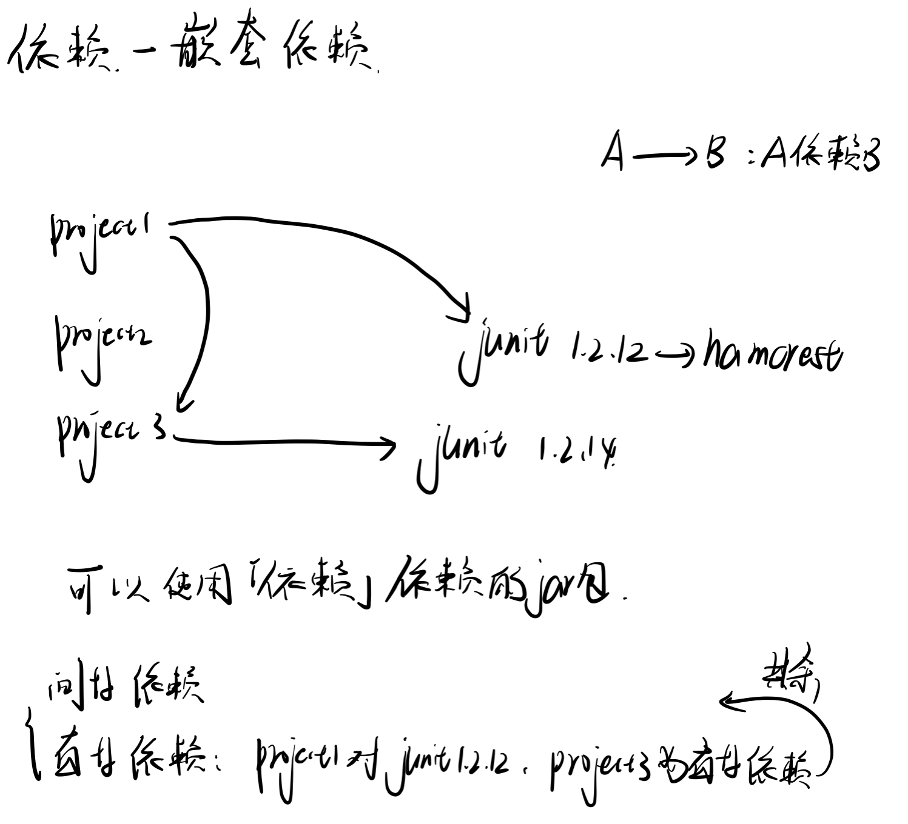
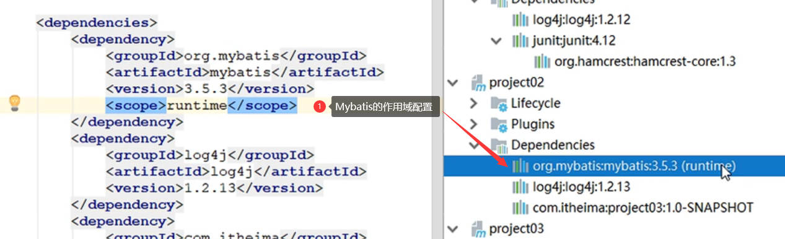
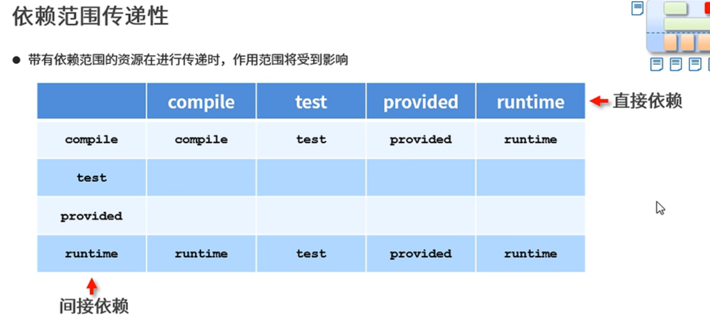
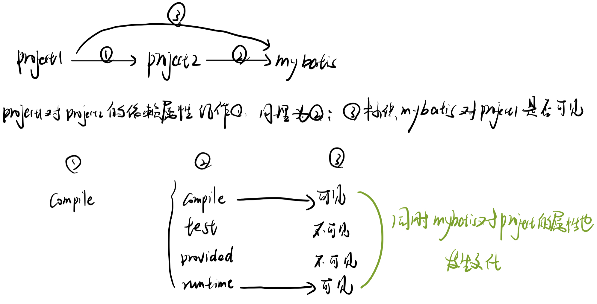

6、Maven依赖管理
=============================================================================

6.1、依赖配置与依赖传递
-------------------------------------------------------------------------------

依赖是指在当前项目中运行所需的jar，依赖配置的格式如下：

```
<!--设置当前项目所依赖的所有jar-->
<dependencies>
    <!--设置具体的依赖-->
    <dependency>
        <!--依赖所属群组id-->
        <groupId>Junit</groupId>
        <!--依赖所属项目id-->
        <artifactId>Junit</artifactId>
        <!--依赖版本号-->
        <version>4.12</version>
    </dependency>
</dependencies>

```

**依赖传递：**

依赖具有传递性，分两种

（1）直接依赖：在当前项目中通过依赖配置建立的依赖关系

（2）间接依赖：被依赖的资源如果依赖其他资源，则表明当前项目间接依赖其他资源

### 6.1.1、依赖传递冲突

**依赖传递的冲突问题：**

在依赖传递过程中产生了冲突，我们有三种优先法则

（1）路径优先：当依赖中出现相同资源时，层级越深，优先级越低，反之则越高

（2）声明优先：当资源在相同层级被依赖时，配置顺序靠前的覆盖靠后的

（3）特殊优先：当同级配置了相同资源的不同版本时，后配置的覆盖先配置的


以一个项目为根，直接依赖称为1度资源，直接依赖的直接依赖称为2度资源，直接依赖的直接依赖的直接依赖称为3度资源。

当然依赖冲突在这里我们并不需要记，后面(Maven高级)会有如何解决此问题的办法。



### 6.1.2、可选依赖

可选依赖指的是**被依赖者**对外隐藏当前所依赖的资源➡不透明,私有

`false`时依赖者可见,`true`时依赖者不可见

*   加一个`<optional>` 标签

```
<dependencies>
    <dependency>
        <groupId>Junit</groupId>
        <artifactId>Junit</artifactId>
        <version>4.12</version>
        <optional>true</optional>
    </dependency>
</dependencies>

```

### 6.1.3、排除依赖

排除依赖指**依赖者**主动断开依赖的资源，被排除的资源无需指定版本➡不用

> 指传递过来的资源不使用

```
<dependencies>
    <dependency>
        <groupId>Junit</groupId>
        <artifactId>Junit</artifactId>
        <version>4.12</version>
        <exclusions>
            <exclusion>
                <groupId>log4j</groupId>
                <artifactId>log4j</artifactId>
            </exclusion>
    </dependency>
</dependencies>

```

6.2、依赖范围
--------------------------------------------------------------------------

依赖的jar默认情况可以在任何地方可用，可以通过`scope`标签设定其作用范围

这里的范围主要是指以下三种范围

（1）主程序范围有效（src/main目录范围内）

（2）测试程序范围内有效（src/test目录范围内）

（3）是否参与打包（package指令范围内）

此外：`scope`标签的取值有四种：`compile,test,provided,runtime`

这四种取值与范围的对应情况如下：


> servlet-api解释
>
> 服务器上就有,打包的话会产生冲突



### 依赖范围的传递性



