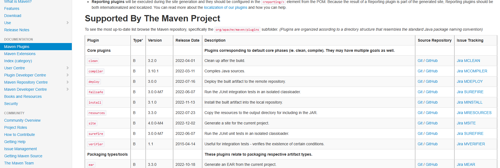
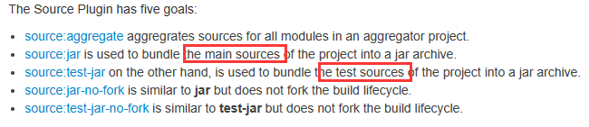
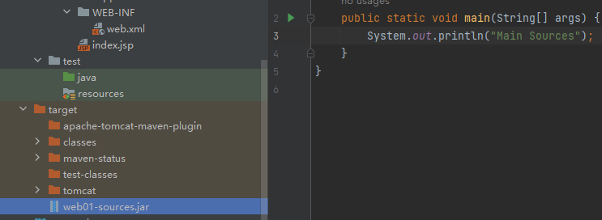
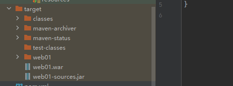
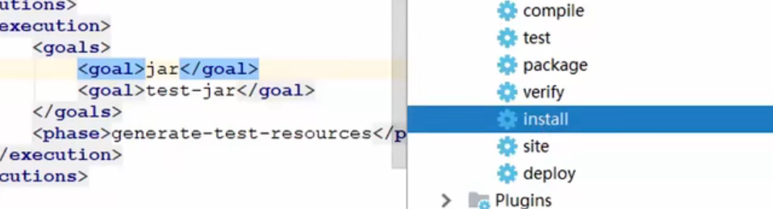
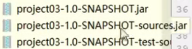

7、Maven生命周期与插件
================================================================================

Maven对项目构建的生命周期划分为3套

*   clear：清理工作
*   default：核心工作，例如编译、测试、打包、部署等
*   site：产生报告、发布站点等

7.1、clear生命周期
-------------------------------------------------------------------------------

clean：清理工作

*   pre-clean：执行一些在clean之前的工作

*   clean：移除上一次构建产生的所有文件

*   post-clean：执行一些在clean之后立刻完成的工作

7.2、default生命周期
---------------------------------------------------------------------------------

default：核心工作，例如编译，测试，打包，部署等

这里面的事件非常的多，如下图


**对于default生命周期，每个事件在执行之前都会将之前的所有事件依次执行一遍**

> 执行test,则前面的都会执行

7.3、site生命周期
------------------------------------------------------------------------------

site：产生报告，发布站点等

*   pre-site：执行一些在生成站点文档之前的工作

*   site：生成项目的站点文档

*   post-site：执行一些在生成站点文档之后完成的工作，为部署做准备

*   site-deploy：将生成的站点文档部署到特定的服务器上

7.4、插件
------------------------------------------------------------------------

**插件：**

*   插件与生命周期内的阶段绑定，在执行到对应生命周期时执行对应的插件
*   maven默认在各个生命周期上都绑定了预先设定的插件来完成相应功能
*   插件还可以完成一些自定义功能

```
https://maven.apache.org/plugins/index.html
```



插件的配置方式如下：我们以打包源码为例

> goals的值
>
> 

```
<build>
    <plugins>
        <plugin>
            <groupId>org.apache.maven.plugins</groupId>
            <artifactId>maven-source-plugin</artifactId>
            <version>2.2.1</version>
            <executions>
            <!--标志执行时间-->
                <excution>
                    <goals>
                        <!--当goal属性的值为test-jar时，是对测试代码打包-->
                        <!--对main中的源码打包-->
                        <goal>jar</goal>
                    </goals>
                    <!--执行时间:声明周期-->
                    <phase>generate-test-resources</phase>
                </excution>
            </executions>
        </plugin>
    </plugins>
</build>

```

在IDEA右侧`maven-project`操作面板上可以看到


这样在IDEA左侧 target目录下就会有我们的源码包


> 使用test



> 使用install,在`generate-test-resources`的时候对源码打一个包,默认install前面有一个package还会打一个包,所以一共两个包



> 叠加goal,即在某个生命周期中打多次包,执行install,一共3个包
>
> 
>
> 