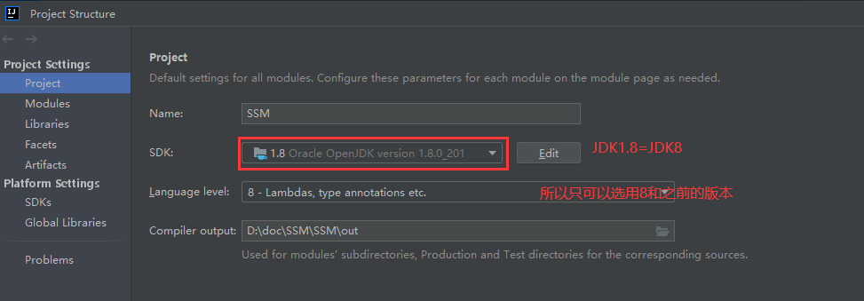
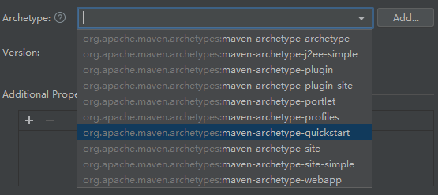
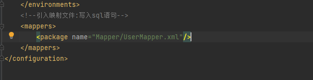
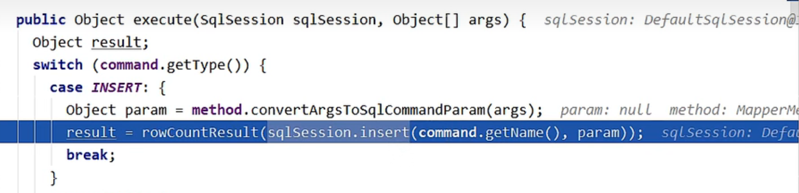
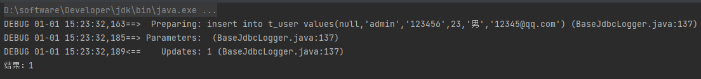

# 2、搭建MyBatis

## 2.1、开发环境

IDE：idea 2019.2

构建工具：maven 3.5.4

MySQL版本：MySQL 8

MyBatis版本：MyBatis 3.5.7

> MySQL不同版本的注意事项
>
> 1、驱动类driver-class-name
>
> MySQL 5版本使用jdbc5驱动，驱动类使用：com.mysql.jdbc.Driver
>
> MySQL 8版本使用jdbc8驱动，驱动类使用：com.mysql.cj.jdbc.Driver
>
> 2、连接地址url
>
> MySQL 5版本的url：
>
> jdbc:mysql://localhost:3306/ssm
>
> MySQL 8版本的url：
>
> jdbc:mysql://localhost:3306/ssm?serverTimezone=UTC
>
> 否则运行测试用例报告如下错误：
>
> java.sql.SQLException: The server time zone value 'Öйú±ê׼ʱ¼ä' is unrecognized or
>
> represents more

## 2.2、创建maven工程

首先配置maven



创建java工程




**①打包方式：jar**

```xml
    <groupId>org.example</groupId>
    <artifactId>test01</artifactId>
    <version>1.0-SNAPSHOT</version>
    <packaging>jar</packaging>
```

**②引入依赖**

```xml
<dependencies>
   <!-- Mybatis核心:连接数据库,操作其中的数据 -->
   <dependency>
       <groupId>org.mybatis</groupId>
       <artifactId>mybatis</artifactId>
       <version>3.5.7</version>
   </dependency>
    
<!-- junit测试 -->
   <dependency>
       <groupId>junit</groupId>
       <artifactId>junit</artifactId>
       <version>4.12</version>
       <scope>test</scope>
   </dependency>
    
<!-- MySQL驱动 -->
   <dependency>
       <groupId>mysql</groupId>
       <artifactId>mysql-connector-java</artifactId>
       <version>8.0.16</version>
   </dependency>
</dependencies>
```

创建一张表,并编写对于的`JavaBean`

```
Integer:id
String:username
String:password
Integer:age
String:gender
String:email
```

```java
public class User {
    //Orm-Bean
    //加入getter&setter,有参无参构造器,toString
    Integer id;
    String username;
    String password;
    Integer age;
    String gender;
    String email;
    ...
}
```

## 2.3、创建MyBatis的核心配置文件

> 习惯上命名为mybatis-config.xml，这个文件名仅仅只是建议，并非强制要求。将来整合Spring
>
> 之后，这个配置文件可以省略，所以大家操作时可以直接复制、粘贴。
>
> 核心配置文件主要用于配置连接数据库的环境以及MyBatis的全局配置信息
>
> 核心配置文件存放的位置是src/main/resources目录下

```xml
<?xml version="1.0" encoding="UTF-8" ?>
<!DOCTYPE configuration
        PUBLIC "-//mybatis.org//DTD Config 3.0//EN"
        "http://mybatis.org/dtd/mybatis-3-config.dtd">
<configuration>
    
	<!--设置连接数据库的环境-->
	<environments default="development">
		<environment id="development">
			<transactionManager type="JDBC"/>
			<dataSource type="POOLED">
				<property name="driver" value="com.mysql.cj.jdbc.Driver"/>
				<property name="url" value="jdbc:mysql://localhost:3306/ssm?serverTimezone=UTC"/>
				<property name="username" value="root"/>
				<property name="password" value="123456"/>
			</dataSource>
		</environment>
	</environments>
<!--引入映射文件-->
<mappers>
	<package name="mappers/UserMapper.xml"/>
</mappers>
</configuration>
```

## 2.4、创建mapper接口

> MyBatis中的mapper接口相当于以前的dao。但是区别在于，mapper仅仅是接口，我们不需要
>
> 提供实现类。
>
> 实现在org.example.Mappper中

```java
public interface UserMapper {
    
    /**
    * 添加用户信息
    */
    int insertUser();
}
```

## 2.5、创建MyBatis的映射文件

相关概念：**ORM**（**O**bject **R**elationship **M**apping）对象关系映射。

- 对象：Java的实体类对象
- 关系：关系型数据库
- 映射：二者之间的对应关系

| **Java概念** | **数据库概念** |
| ------------ | -------------- |
| 类           | 表             |
| 属性         | 字段/列        |
| 对象         | 记录/行        |

> 1、映射文件的命名规则：
>
> 表所对应的实体类的类名+Mapper.xml
>
> 例如：表t_user，映射的实体类为User，所对应的映射文件为UserMapper.xml
>
> 因此一个映射文件对应一个实体类，对应一张表的操作
>
> MyBatis映射文件用于编写SQL，访问以及操作表中的数据
>
> MyBatis映射文件存放的位置是src/main/resources/mappers目录下
>
> 2、 MyBatis中可以面向接口操作数据，要保证两个一致：
>
> a > mapper接口的全类名和映射文件的命名空间（namespace）保持一致
>
> `namespace="com.atguigu.mybatis.mapper.UserMapper"`
>
> b > mapper接口中方法的方法名和映射文件中编写SQL的标签的id属性保持一致
>
> `<insert id="insertUser">`

```xml
<?xml version="1.0" encoding="UTF-8" ?>
<!DOCTYPE mapper
        PUBLIC "-//mybatis.org//DTD Mapper 3.0//EN"
		"http://mybatis.org/dtd/mybatis-3-mapper.dtd">
<mapper namespace="com.atguigu.mybatis.mapper.UserMapper">
	<!--int insertUser();-->
	<insert id="insertUser">
		insert into t_user values(null,'admin','123456',23,'男','12345@qq.com')
	</insert>
</mapper>
```

同时最后还要在`Mybatis核心配置文件`中加入映射文件的地址




## 2.6、通过junit测试功能

```java
public class UserInsertTest {

    @Test
    public void testInsert() throws IOException {
        //获取核心配置文件的输入流
        InputStream is = Resources.getResourceAsStream("mybatis-config.xml");
        //获取SqlSessionFactoryBuilder对象
        SqlSessionFactoryBuilder sqlSessionFactoryBuilder = new SqlSessionFactoryBuilder();
        //获取SqlSessionFactory对象
        SqlSessionFactory sqlSessionFactory = sqlSessionFactoryBuilder.build(is);
//        //获取sql的会话对象SqlSession(不会自动提交事务)，是MyBatis提供的操作数据库对象
//        SqlSession sqlSession = sqlSessionFactory.openSession();
        //获取sql的会话对象SqlSession(会自动提交事务)，是MyBatis提供的操作数据库对象
        SqlSession sqlSession = sqlSessionFactory.openSession(true);
        //不加这句时,sql语句执行后回滚,即相当于没有提交,数据库中的表没有效果,但是曾经是添加了一条数据的

        //获取UserMapper的代理实现类对象
        //代理模式
        UserMapper mapper = sqlSession.getMapper(UserMapper.class);
        //调用mapper接口中的方法，实现添加用户信息的功能
        int result = mapper.insertUser();
        System.out.println("结果：" + result);
//        //手动提交事务
//        sqlSession.commit();
        //关闭SqlSession
        sqlSession.close();
    }

}
```

> - SqlSession：代表Java程序和**数据库**之间的**会话**。（HttpSession是Java程序和浏览器之间的会话）
>
> - SqlSessionFactory：是“生产”SqlSession的“工厂”。
> - 工厂模式：如果创建某一个对象，使用的过程基本固定，那么我们就可以把创建这个对象的
>
> 相关代码封装到一个“工厂类”中，以后都使用这个工厂类来“生产”我们需要的对象。

两种方式:

```java
        //===========方式1==========
        //获取UserMapper的代理实现类对象
        //使用Mapper接口来执行sql语句,较常用
        //代理模式
        UserMapper mapper = sqlSession.getMapper(UserMapper.class);
        //调用mapper接口中的方法，定位到UserMapper中的sql语句,实现添加用户信息的功能
        int result = mapper.insertUser();
        //================================
```

```java
        //===========方式2===========
        //提供sql的唯一标志:mapper_namespace.sqlst_id
        //匹配sql语句并执行
        int result = sqlSession.insert("org.example.Mapper.UserMapper.insertUser");
        //======================
```

> 方式1的底层实现就是方式2
>
> 

## 2.7、加入log4j日志功能

`log4j`是一个比较重要的日志框架

### ①加入依赖

```xml
<!-- log4j日志 -->
<dependency>
    <groupId>log4j</groupId>
    <artifactId>log4j</artifactId>
    <version>1.2.17</version>
</dependency>
```

### ②加入log4j的配置文件

> log4j的配置文件名为log4j.xml，存放的位置是src/main/resources目录下

```xml
<?xml version="1.0" encoding="UTF-8" ?>
<!DOCTYPE log4j:configuration SYSTEM "log4j.dtd">
<log4j:configuration xmlns:log4j="http://jakarta.apache.org/log4j/">
	<appender name="STDOUT" class="org.apache.log4j.ConsoleAppender">
		<param name="Encoding" value="UTF-8" />
		<layout class="org.apache.log4j.PatternLayout">
			<param name="ConversionPattern" value="%-5p %d{MM-dd HH:mm:ss,SSS}%m (%F:%L) \n" />
		</layout>
	</appender>
	<logger name="java.sql">
		<level value="debug" />
	</logger>
	<logger name="org.apache.ibatis">
		<level value="info" />
	</logger>
	<root>
		<level value="debug" />
		<appender-ref ref="STDOUT" />
	</root>
</log4j:configuration>
```

> **日志的级别**
>
> FATAL(致命)>ERROR(错误)>WARN(警告)>INFO(信息)>DEBUG(调试)
>
> 从左到右打印的内容越来越详细



## 2.8 建立工具类,加入增删改功能

### 1.建立工具类

在org.example.utils内建立

```java
public class SqlSessionUtil {

    public static SqlSession getSqlSession()  {
        SqlSession sqlSession=null;
        try {
            //4步
            //Is->SqlSessionFactoryBuilder->SqlSessionFactory->sqlSession
            //获取核心配置文件的输入流
            InputStream is = Resources.getResourceAsStream("mybatis-config.xml");
            //获取SqlSessionFactoryBuilder对象
            SqlSessionFactoryBuilder sqlSessionFactoryBuilder = new SqlSessionFactoryBuilder();
            //获取SqlSessionFactory对象
            SqlSessionFactory sqlSessionFactory = sqlSessionFactoryBuilder.build(is);
            //获取sql的会话对象SqlSession(会自动提交事务)
            sqlSession = sqlSessionFactory.openSession(true);
        } catch (IOException e) {
            throw new RuntimeException(e);
        }
        return sqlSession;
    }

}
```

### 2.在`UserMapper.java`中加入update的方法

```java
public interface UserMapper {
    int insertUser();
    void updateUser();//new add
}
```

### 3.在`UserMapper.xml`中加入update标签-内嵌sql语句

```xml
    <!--void updateUser();-->
    <update id="updateUser">
        update t_user set username = 'root',password='123' where id = 1
    </update>
```

### 4.在`UserMapperTest`中加入方法

```java
    @Test
    public void testUpdate(){
        SqlSession sqlSession = SqlSessionUtil.getSqlSession();
        UserMapper mapper = sqlSession.getMapper(UserMapper.class);
        mapper.updateUser();
        sqlSession.close();
    }
```

成功加入一个更新方法,以此类推加入删除方法

## 2.9 加入查询功能

查询的时候有返回值,所以再`UserMapper.xml`的标签需要加入一个映射属性`resultType`与`resultMap`

> `resultType`:设置结果类型，即查询的数据要转化为的java类型
                    		即数据库的属性和Bean的属性名字一致时使用resultType
     						~~只写转换的Bean类型或者基本类型,不写集合类型~~
     
     `resultMap`：自定义映射，处理多对一或一对多的映射关系
                    		即数据库的属性和Bean的属性名字不一样是使用resultMap
     两个属性不能同时存在

```xml
    <!--    User getUserById();-->
	<!--    写全类名-->
    <select id="getUserById" resultType="org.example.pojo.User">
        select * from t_user where id = 2
    </select>

    <!--    List<User> getAllUser();-->
    <!-- resultType写User,先转换为实体类对象后再加入集合类型-->
    <select id="getAllUser" resultType="org.example.pojo.User">
        select * from t_user
    </select>
```

```res
User{id=1, username='admin', password='123456', age=23, gender='男', email='12345@qq.com'}
User{id=3, username='admin', password='123456', age=23, gender='男', email='12345@qq.com'}
```

