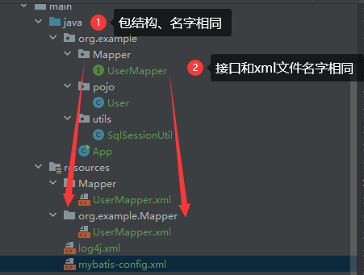
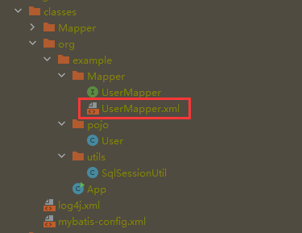

# 3.核心配置文件

## 3.1Environments复数标签

配置连接数据库的环境

`default`默认使用的环境的id

### enviroment标签

子标签

```xml
<transactionManager type="JDBC"/>
<dataSource type="POOLED">
    <!--四个属性进行设置-->
                <!--设置连接数据库的驱动-->
                <property name="driver" value="${jdbc.driver}"/>
                <!--设置连接数据库的连接地址-->
                <property name="url" value="${jdbc.url}"/>
                <!--设置连接数据库的用户名-->
                <property name="username" value="${jdbc.username}"/>
                <!--设置连接数据库的密码-->
                <property name="password" value="${jdbc.password}"/>
</dataSource>
```


```xml
    <!--
        environments：配置多个连接数据库的环境
        属性：
        default：设置默认使用的环境的id
    -->
    <environments default="development">
        <!--
            environment：配置某个具体的环境
            属性：
            id：表示连接数据库的环境的唯一标识，不能重复
        -->
        <environment id="development">
            <!--
                transactionManager：设置事务管理方式
                属性：
                type="JDBC|MANAGED"
                JDBC：表示当前环境中，执行SQL时，使用的是JDBC中原生的事务管理方式，事
                务的提交或回滚需要手动处理
                MANAGED：被管理，例如Spring
            -->
            <transactionManager type="JDBC"/>
            <!--
                dataSource：配置数据源
                属性：
                type：设置数据源的类型
                type="POOLED|UNPOOLED|JNDI"
                POOLED：表示使用数据库连接池缓存数据库连接
                UNPOOLED：表示不使用数据库连接池
                JNDI：表示使用上下文中的数据源
            -->
            <dataSource type="POOLED">
                <!--设置连接数据库的驱动-->
                <property name="driver" value="${jdbc.driver}"/>
                <!--设置连接数据库的连接地址-->
                <property name="url" value="${jdbc.url}"/>
                <!--设置连接数据库的用户名-->
                <property name="username" value="${jdbc.username}"/>
                <!--设置连接数据库的密码-->
                <property name="password" value="${jdbc.password}"/>
            </dataSource>
        </environment>

        <environment id="test">
            <transactionManager type="JDBC"/>
            <dataSource type="POOLED">
                <!--设置连接数据库的驱动-->
                <property name="driver" value="${jdbc.driver}"/>
                <!--设置连接数据库的连接地址-->
                <property name="url" value="${jdbc.url}"/>
                <!--设置连接数据库的用户名-->
                <property name="username" value="${jdbc.username}"/>
                <!--设置连接数据库的密码-->
                <property name="password" value="${jdbc.password}"/>
            </dataSource>
        </environment>
    </environments>
```

## 3.2 properties标签

之前的jdbc使用是将四个要素放在`xxxx.properties`文件中

`jdbc.properties`

属性写成文件名.属性,用于标志唯一

```
jdbc.driver=
jdbc.username=
jdbc.password=
jdbc.url=
```

```
    <!--引入properties文件后则可以使用${key}访问-->
    <properties resource="jdbc.properties" />
```

${key}访问

```xml
		<dataSource type="POOLED">
            <!--设置连接数据库的驱动-->
        	<property name="driver" value="${jdbc.driver}"/>
            <!--设置连接数据库的连接地址-->
            <property name="url" value="${jdbc.url}"/>
            <!--设置连接数据库的用户名-->
            <property name="username" value="${jdbc.username}"/>
            <!--设置连接数据库的密码-->
            <property name="password" value="${jdbc.password}"/>
		</dataSource>
```

## 3.3 typeAliases标签

为某个具体的类型设置一个别名,在mybatis的范围中我们就可以使用别名来设置一个类型

一般我们用于简化全类名

1. 指定类的别名
2. 不指定,默认别名
3. package一个包,包下面的类都是别名

```xml
    <!--mybatis-config.xml-->
	<typeAliases>
    		<!--
            typeAlias：设置某个类型的别名
            属性：
            type：设置需要设置别名的类型,一般是类的全类名
            alias：设置某个类型的别名，若不设置该属性，那么该类型拥有默认的别名，即类名
            且不区分大小写
       		-->
        <typeAlias type="org.example.pojo.User" alias="User"></typeAlias>
    </typeAliases>
```

```xml
        <!--不设置alias,默认别名为类名/user/i,不区分大小写-->
        <typeAlias type="org.example.pojo.User" ></typeAlias>
```

```xml
        <!--此时包中的所有类拥有别名-->
		<!--以包为单位，将包下所有的类型设置默认的类型别名，即类名且不区分大小写--->
        <package name="org.example"/>
```


## 3.4 mappers标签	

以包为单位导入映射文件需要两个一致

            以包为单位引入映射文件
            要求：
            1、mapper接口所在的包要和映射文件所在的文件夹的结构、名字一致
            2、mapper接口要和映射文件的名字一致



```xml
    <!--引入映射文件:写入sql语句-->
    <mappers>
        <package name="org.example.Mapper"/>
	<!--        <mapper resource="Mapper/UserMapper.xml"/>-->
    </mappers>
```

最后映射文件和java文件夹的文件合并，即可以通过`package`指明的路径找到映射文件。在`target`中可以看到加载后的文件夹情况



------


## 3.5 Summary

> 核心配置文件中的标签必须按照固定的顺序：
>
> properties?,settings?,typeAliases?,typeHandlers?,objectFactory?,objectWrapperFactory?,refl
>
> ectorFactory?,plugins?,environments?,databaseIdProvider?,mappers?
>
> ```xml
> <?xml version="1.0" encoding="UTF-8" ?>
> <!DOCTYPE configuration
>      PUBLIC "-//mybatis.org//DTD Config 3.0//EN"
>      "http://mybatis.org/dtd/mybatis-3-config.dtd">
> <configuration>
> 	<!--
>          MyBatis核心配置文件中，标签的顺序：
>          properties?,settings?,typeAliases?,typeHandlers?,
>          objectFactory?,objectWrapperFactory?,reflectorFactory?,
>          plugins?,environments?,databaseIdProvider?,mappers?
> 	-->
> 	<!--引入properties文件-->
> 	<properties resource="jdbc.properties" />
> 	<!--设置类型别名-->
> 	<typeAliases>
> 	<!--
> 		typeAlias：设置某个类型的别名
> 		属性：
> 			type：设置需要设置别名的类型
> 			alias：设置某个类型的别名，若不设置该属性，那么该类型拥有默认的别名，即类名且不区分大小写
> 	-->
> 		<!--<typeAlias type="com.atguigu.mybatis.pojo.User"></typeAlias>-->
> 		<!--以包为单位，将包下所有的类型设置默认的类型别名，即类名且不区分大小写-->
> 		<package name="com.atguigu.mybatis.pojo"/>
> 	</typeAliases>
> 	<!--
> 		environments：配置多个连接数据库的环境
> 		属性：
> 			default：设置默认使用的环境的id
> 	-->
> 	<environments default="development">
>  <!--
> 		environment：配置某个具体的环境
> 		属性：
> 			id：表示连接数据库的环境的唯一标识，不能重复
> 	-->
> 	<environment id="development">
> 		<!--
> 			transactionManager：设置事务管理方式
> 			属性：
> 				type="JDBC|MANAGED"
> 				JDBC：表示当前环境中，执行SQL时，使用的是JDBC中原生的事务管理方式，事务的提交或回滚需要手动处理
> 				MANAGED：被管理，例如Spring
> 		-->
> 			<transactionManager type="JDBC"/>
> 			<!--
> 				dataSource：配置数据源
> 				属性：
>               type：设置数据源的类型
>               type="POOLED|UNPOOLED|JNDI"
>                  POOLED：表示使用数据库连接池缓存数据库连接
>                  UNPOOLED：表示不使用数据库连接池
>                  JNDI：表示使用上下文中的数据源
> 			-->
> 				<dataSource type="POOLED">
>               <!--设置连接数据库的驱动-->
>               <property name="driver" value="${jdbc.driver}"/>
>                  <!--设置连接数据库的连接地址-->
>                  <property name="url" value="${jdbc.url}"/>
>                  <!--设置连接数据库的用户名-->
>                  <property name="username" value="${jdbc.username}"/>
>                  <!--设置连接数据库的密码-->
>                  <property name="password" value="${jdbc.password}"/>
> 				</dataSource>
> 			</environment>
> 			<environment id="test">
>           <transactionManager type="JDBC"/>
>           <dataSource type="POOLED">
>              <property name="driver" value="com.mysql.cj.jdbc.Driver"/>
>              <property name="url"value="jdbc:mysql://localhost:3306/ssmserverTimezone=UTC"/>
>              <property name="username" value="root"/>
>              <property name="password" value="123456"/>
> 			</dataSource>
> 		</environment>
> 	</environments>
> 	<!--引入映射文件-->
> 	<mappers>
> 	<!--<mapper resource="mappers/UserMapper.xml"/>-->
> 	<!--
>       以包为单位引入映射文件
>          要求：
>          1、mapper接口所在的包要和映射文件所在的包一致
>          2、mapper接口要和映射文件的名字一致
> 	-->
> 		<package name="com.atguigu.mybatis.mapper"/>
> 	</mappers>
> </configuration>
> ```

------

## 3.6 创建核心配置文件和映射文件的模板

核心配置文件模板

`mybatis-config`文件后缀`.xml`

```xml
<?xml version="1.0" encoding="UTF-8" ?>
<!--xml约束-->
<!DOCTYPE configuration
        PUBLIC "-//mybatis.org//DTD Config 3.0//EN"
        "http://mybatis.org/dtd/mybatis-3-config.dtd">
<!--配置的根标签-->
<configuration>
	
    <properties resource="jdbc.properties" />
    
    <typeAliases>
        <package name=""/>
    </typeAliases>

    <!--设置连接数据库的环境-->
    <environments default="development">
        <environment id="development">
            <transactionManager type="JDBC"/>
            <dataSource type="POOLED">
                <property name="driver" value="${jdbc.driver}"/>
                <property name="url" value="${jdbc.url}"/>
                <property name="username" value="${jdbc.username}"/>
                <property name="password" value="${jdbc.password}"/>
            </dataSource>
        </environment>
    </environments>


    <!--引入映射文件:写入sql语句-->
    <mappers>
        <package name=""/>
    </mappers>
</configuration>
```

映射文件模板

`mybatis-mapper`  文件后缀`.xml`

```xml
<?xml version="1.0" encoding="UTF-8" ?>
<!DOCTYPE mapper
        PUBLIC "-//mybatis.org//DTD Mapper 3.0//EN"
        "http://mybatis.org/dtd/mybatis-3-mapper.dtd">
<mapper namespace="">

</mapper>
```

