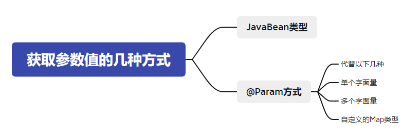

# 5、MyBatis获取参数值的两种方式

前言:现在我们只有一个mapper接口和对应的映射文件,sql语句写死在映射文件中,我们需要在映射文件中获取参数值

> MyBatis获取参数值的两种方式：**${}**和**#{}**
>
> ${}的本质就是字符串拼接，#{}的本质就是占位符赋值
>
> ${}使用字符串拼接的方式拼接sql，若为字符串类型或日期类型的字段进行赋值时，需要手动加单引号；会有sql注入问题
>
> 但是#{}使用占位符赋值的方式拼接sql，此时为字符串类型或日期类型的字段进行赋值时，可以自动添加单引号;不会有sql注入问题

#{}的使用规则

可以以任意内容获取值
一般建议使用有意义的内容比如参数名获取

```sql
select `id`,`username`,`password`,`age`,`gender`,`email` FROM t_user WHERE `username`=#{username};
//解释为
select `id`,`username`,`password`,`age`,`gender`,`email` FROM t_user WHERE `username`='admin'
//自动加引号
```

${}的使用

传入数值表达式会进行计算
一般建议使用有意义的内容比如参数名获取

```sql
select `id`,`username`,`password`,`age`,`gender`,`email` FROM t_user WHERE `username`=${username};
//解释为
select `id`,`username`,`password`,`age`,`gender`,`email` FROM t_user WHERE `username`=admin
//不会自动加引号,被当成一个属性解释,错误
//字符串直接拼接
```

```sql
select `id`,`username`,`password`,`age`,`gender`,`email` FROM t_user WHERE `username`='${username}';
//解释为
select `id`,`username`,`password`,`age`,`gender`,`email` FROM t_user WHERE `username`='admin'
//执行成功
```


## 5.1、单个字面量类型的参数

字面量类型:基本数据类型,string,包装类

> 若mapper接口中的方法参数为单个的字面量类型
>
> 此时可以使用${}和#{}以任意的名称获取参数的值，注意${}需要手动加单引号


## 5.2、多个字面量类型的参数

```java
    /**
     * 验证是否有这个账号和密码,没有则返回null,有返回一个User
     * @param username
     * @param password
     * @return
     */
    User checkLogin(String username,String password);
```

> 若mapper接口中的方法参数为多个时
>
> 此时MyBatis会自动将这些参数放在一个map集合中，以两种方式存储数据
> 以arg0,arg1...为键，以参数为值；
> 以param1,param2...为键，以参数为值；
>
> 因此只需要通过${}和#{}访问map集合的键就可以获取相
>
> 对应的值，注意${}需要手动加单引号

```xml
#{param1...n}/#{agr0...n-1}
${param1...n}/${arg0...n-1}
通用param和arg可以混合使用
```

```xml
    <!--User checkLogin(String username,String password);-->
    <select id="checkLogin" resultType="User">
        select * FROM t_user WHERE `username`=#{arg0} and `password`=#{arg1}
        <!--select * FROM t_user WHERE `username`='${arg0}' and `password`='${arg1}'-->
		<!--添加引号-->
    </select>
```


## 5.3、map集合类型的参数

我们自定义一个`Map`传入,就可以使用`#{}/${}`通过键访问

```java
User checkLoginByMap(Map<String,String>map);
//=====================================================
    @Test
    public void TestUserQLoginByMap(){
        SqlSession sqlSession = SqlSessionUtil.getSqlSession();
        UserMapper mapper = sqlSession.getMapper(UserMapper.class);
        Map<String,String> map=new HashMap<String,String>();
        map.put("username","admin");
        map.put("password","123456");

        System.out.println(mapper.checkLoginByMap(map));
        //User{id=1, username='admin', password='123456', age=23, gender='男', email='12345@qq.com'}
        sqlSession.close();
    }
```

> 若mapper接口中的方法需要的参数为多个时，此时可以手动创建map集合，将这些数据放在map中
>
> 猜测:此时MyBatis会自动将Map的这些参数(指键值对)放在自己的map集合中
>
> 只需要通过${}和#{}访问map集合的键就可以获取相对应的值，注意${}需要手动加单引号

```xml
    <!--User checkLoginByMap(Map<String,String>map);-->
    <select id="checkLoginByMap" resultType="User">
        select * FROM t_user WHERE `username`=#{username} and `password`=#{password}
    </select>
```

一般的增删改查是`#`用的多一些
但是对于一些特殊情况是只能使用`$`

## 5.4、实体类类型的参数

service层调用Mapper层的接口插入一条数据

```
void insertUser(User user);
```

> 若mapper接口中的方法参数为实体类对象时
>
> 此时可以使用${}和#{}，通过访问实体类对象中的属性名获取属性值，注意${}需要手动加单引号

```xml
    <!--void insertUser(User user);-->
    <select id="insertUser">
        INSERT INTO t_user VALUES(NULL,#{username},#{password},#{age},#{gender},#{email});
    </select>
```

> 说明:mybaits是通过get方法来获取javaBean中的值,所以get方法去掉get后面的字母小写才是属性, 
>
> ==没有成员变量不影响我们写getter方法==

## 5.5、使用@Param标识参数

```java
User checkLoginByParam(@Param("username")String username,@Param("password")String password);
```

> 可以通过@Param注解标识mapper接口中的方法参数
>
> ==两种方式:==
>
> 此时，mybatis会将这些参数放在map集合中，以@Param注解的value属性值为键，以参数为值；
> 以param1,param2...为键，以参数为值；
>
> 此时没有[arg0...n-1]的方式
>
> 只需要通过${}和#{}访问map集合的键就可以获取相对应的值，
>
> 注意${}需要手动加单引号

```xml
    <!--User checkLoginByParam(@Param("username")String username,@Param("password")String password);-->
    <select id="checkLoginByParam" resultType="User">
        select * FROM t_user WHERE `username`=#{username} and `password`=#{password}
    </select>
```

