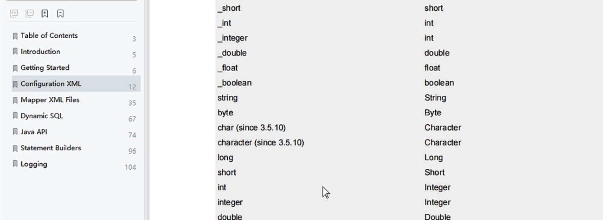
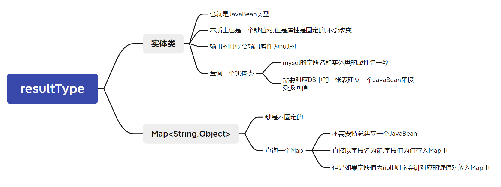

# 6、MyBatis的各种查询功能

## 6.1、查询一个实体类对象

```java
/**
* 根据用户id查询用户信息
* @param id
* @return
*/
User getUserById(@Param("id") int id);
```

```xml
<!--User getUserById(@Param("id") int id);-->
<select id="getUserById" resultType="User">
	select * from t_user where id = #{id}
</select>
```

## 6.2、查询一个list集合

```java
/**
* 查询所有用户信息
* @return
*/
List<User> getUserList();
```

```xml
<!--List<User> getUserList();-->
<select id="getUserList" resultType="User">
	select * from t_user
</select>
```

> 当查询的数据为多条时,在方法中不能使用实体类作为返回值，否则会抛出异常`TooManyResultsException`；
>
> 但是若查询的数据只有一条，在方法中可以使用实体类或集合作为返回值

## 6.3、查询单个数据

查询单行单列的字段,统计值,分组值...



```java
/**
* 查询用户的总记录数
* @return
* 在MyBatis中，对于Java中常用的类型都设置了类型别名,别名不区分大小写
* 例如： java.lang.Integer-->int|integer
* 例如： int-->_int|_integer
* 例如： Map-->map,List-->list
*/
int getCount();
```

```xml
<!--int getCount();-->
<!--<select id="getCount" resultType="java.lang.Integer">-->
<!--<select id="getCount" resultType="int">-->
<!--<select id="getCount" resultType="Integer">-->
<!--<select id="getCount" resultType="integer">-->
<select id="getCount" resultType="_integer">
	select count(id) from t_user
</select>
```

## 6.4、查询一条数据为map集合

```java
/**
* 根据用户id查询用户信息为map集合
* @param id
* @return
*/
Map<String, Object> getUserToMap(@Param("id") int id);
```

```xml
<!--Map<String, Object> getUserToMap(@Param("id") int id);-->
<!--结果： {password=123456, sex=男 , id=1, age=23, username=admin}-->
<select id="getUserToMap" resultType="map">
	select * from t_user where id = #{id}
</select>
```




## 6.5、查询多条数据为map集合

### ①方式一

```java
/**
* 查询所有用户信息为map集合
* @return
* 将表中的数据以map集合的方式查询，一条数据对应一个map；若有多条数据，就会产生多个map集合，此
时可以将这些map放在一个list集合中获取
*/
List<Map<String, Object>> getAllUserToMap();
```

```xml
<!--Map<String, Object> getAllUserToMap();-->
<select id="getAllUserToMap" resultType="map">
	select * from t_user
</select>
```

### ②方式二

```java
/**
* 查询所有用户信息为map集合
* @return
* 
将表中的数据以map集合的方式查询，一条数据对应一个map；
若有多条数据，就会产生多个map集合，并且最终要以一个map的方式返回数据，
此时需要通过@MapKey注解设置map集合的键，值是每条数据所对应的map集合
=========================================================
@MapKey注解的参数应该是查询到的数据的字段
*/
@MapKey("id")
Map<String, Object> getAllUserToMap();
```

```xml
<!--Map<String, Object> getAllUserToMap();-->
<!--
{
    1={password=123456, sex=男, id=1, age=23, username=admin},
    2={password=123456, sex=男, id=2, age=23, username=张三},
    3={password=123456, sex=男, id=3, age=23, username=张三}
}
-->
<select id="getAllUserToMap" resultType="map">
	select * from t_user
</select>
```

