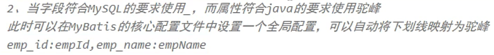
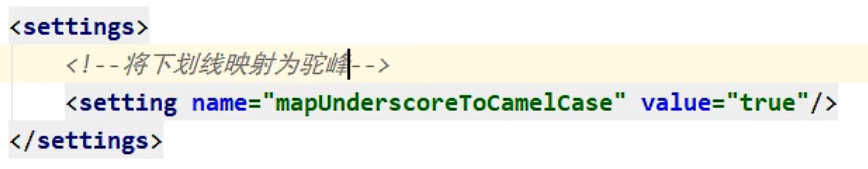
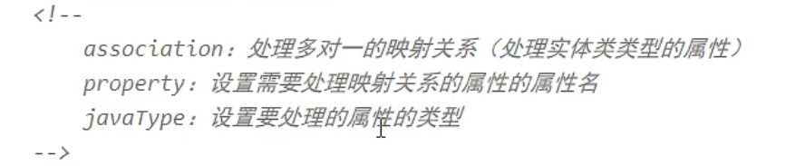
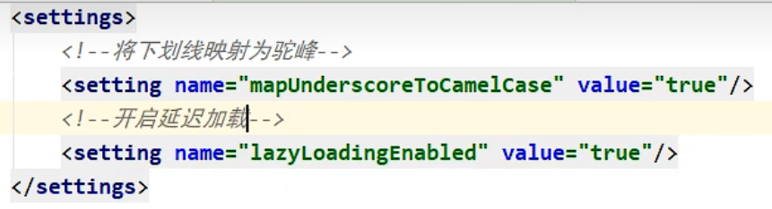
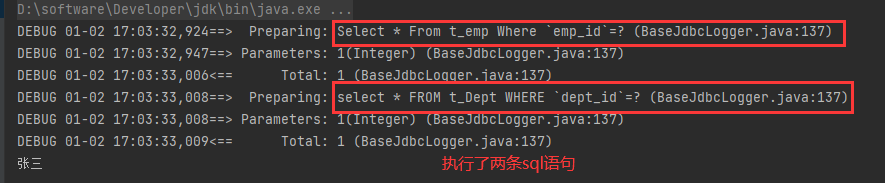

# 8、自定义映射resultMap

## 8.1、resultMap处理字段和属性的映射关系

> 注意:字段名是数据库中的列名,属性名就是实体类的属性名
>
> 若字段名和实体类中的属性名不一致，则可以通过resultMap设置自定义映射

### 1.使用sql别名将字段名重命名为属性名

```xml
    <!--Emp getEmpById(@Param("id") int id);-->
    <select id="getEmpById" resultType="Emp">
        select emp_id EmpId,emp_name EmpName,age,gender from t_emp where `emp_id`=#{id}
    </select>
```

### 2.使用全局配置处理不一致





### 3.使用resultMap

```xml
<!--
    resultMap：设置自定义映射
    属性：
    id：表示自定义映射的唯一标识
    type：查询的数据要映射的实体类的类型
    子标签：
    id：设置主键和属性的映射关系
    result：设置普通字段和属性的映射关系
    association：设置多对一的映射关系(也可以处理一对一,处理实体类型的属性,比如Dept)
    collection：设置一对多的映射关系
    属性：
    property：设置映射关系中实体类中的属性名
    column：设置映射关系中表中的字段名
-->
<resultMap id="userMap" type="User">
    <id property="id" column="id"></id>
    <result property="userName" column="user_name"></result>
    <result property="password" column="password"></result>
    <result property="age" column="age"></result>
    <result property="sex" column="sex"></result>
</resultMap>
<!--List<User> testMohu(@Param("mohu") String mohu);-->
<select id="testMohu" resultMap="userMap">
	<!--select * from t_user where username like '%${mohu}%'-->
select id,user_name,password,age,sex from t_user where user_name likeconcat('%',#{mohu},'%')
</select>
```

> 若字段名和实体类中的属性名不一致，但是字段名符合数据库的规则（使用_），实体类中的属性名符合Java的规则（使用驼峰）
>
> 此时也可通过以下两种方式处理字段名和实体类中的属性的映射关系
>
> a>可以通过为字段起别名的方式，保证和实体类中的属性名保持一致
>
> b>可以在MyBatis的核心配置文件中设置一个全局配置信息mapUnderscoreToCamelCase，可以在查询表中数据时，自动将_类型的字段名转换为驼峰
>
> 例如：字段名user_name，设置了mapUnderscoreToCamelCase，此时字段名就会转换为userName
>

## 8.2、多对一映射处理

> 场景模拟：
>
> 查询员工信息以及员工所对应的部门信息

```java
//Emp中有一个属性为private Dept dept;
//需要将多表联查的结果映射置dept中
dept_id,dept_name字段=>dept属性
```

### 8.2.1、级联方式处理映射关系

```xml
<resultMap id="empDeptMap" type="Emp">
    <id column="eid" property="eid"></id>
    <result column="ename" property="ename"></result>
    <result column="age" property="age"></result>
    <result column="sex" property="sex"></result>
    <result column="did" property="dept.did"></result>
    <result column="dname" property="dept.dname"></result>
</resultMap>
<!--Emp getEmpAndDeptByEid(@Param("eid") int eid);-->
<select id="getEmpAndDeptByEid" resultMap="empDeptMap">
	select emp.*,dept.* from t_emp emp left join t_dept dept on emp.did =dept.did where emp.eid = #{eid}
</select>
```

### 8.2.2、使用association处理映射关系



```xml
<resultMap id="empDeptMap" type="Emp">
    <id column="eid" property="eid"></id>
    <result column="ename" property="ename"></result>
    <result column="age" property="age"></result>
    <result column="sex" property="sex"></result>
    <association property="dept" javaType="Dept">
        <id column="did" property="did"></id>
        <result column="dname" property="dname"></result>
	</association>
</resultMap>
<!--Emp getEmpAndDeptByEid(@Param("eid") int eid);-->
<select id="getEmpAndDeptByEid" resultMap="empDeptMap">
	select emp.*,dept.* from t_emp emp left join t_dept dept on emp.did =dept.did where emp.eid = #{eid}
</select>
```

### 8.2.3、分步查询

#### ①查询员工信息

```java
/**
* 通过分步查询查询员工信息
* @param eid
* @return
*/
Emp getEmpByStep(@Param("eid") int eid);
```

```xml
<resultMap id="empDeptStepMap" type="Emp">
    <id column="eid" property="eid"></id>
    <result column="ename" property="ename"></result>
    <result column="age" property="age"></result>
    <result column="sex" property="sex"></result>
	<!--
		property:需要设置映射关系的属性的属性名
        select：设置分步查询的下一步的sql的唯一标识，查询某个属性的值的sql的唯一的标识（namespace.sqlId）
        column：将sql以及查询结果中的某个字段作为分步查询的条件
		为了查询dept,我们通过select标志的唯一的sql语句和当前sql查询到的字段column来进行查询
	-->
	<association property="dept"
                 select="com.atguigu.MyBatis.mapper.DeptMapper.getEmpDeptByStep" 
                 column="did">
	</association>
</resultMap>
<!--Emp getEmpByStep(@Param("eid") int eid);-->
<select id="getEmpByStep" resultMap="empDeptStepMap">
	select * from t_emp where eid = #{eid}
</select>
```

#### ②根据员工所对应的部门id查询部门信息

```java
/**
* 分步查询的第二步： 根据员工所对应的did查询部门信息
* @param did
* @return
*/
Dept getEmpDeptByStep(@Param("did") int did);
```

```xml
<!--Dept getEmpDeptByStep(@Param("did") int did);-->
<select id="getEmpDeptByStep" resultType="Dept">
	select * from t_dept where did = #{did}
</select>
```


## 8.3、一对多映射处理

### 8.3.1、collection

```java
/**
* 根据部门id查新部门以及部门中的员工信息
* @param did
* @return
*/
Dept getDeptEmpByDid(@Param("did") int did);
```

```xml
<resultMap id="deptEmpMap" type="Dept">
    <id property="did" column="did"></id>
    <result property="dname" column="dname"></result>
    <!--
		collection:处理一对多,处理集合类型的属性
		ofType：设置collection标签所处理的集合属性中存储数据的类型
	-->
	<collection property="emps" ofType="Emp">
        <id property="eid" column="eid"></id>
        <result property="ename" column="ename"></result>
        <result property="age" column="age"></result>
        <result property="sex" column="sex"></result>
	</collection>
</resultMap>
<!--Dept getDeptEmpByDid(@Param("did") int did);-->
<select id="getDeptEmpByDid" resultMap="deptEmpMap">
	select dept.*,emp.* from t_dept dept left join t_emp emp on dept.did =emp.did where dept.did = #{did}
</select>
```

### 8.3.2、分步查询

### ①查询部门信息

```java
/**
* 分步查询部门和部门中的员工
* @param did
* @return
*/
Dept getDeptByStep(@Param("did") int did);
```

```xml
<resultMap id="deptEmpStep" type="Dept">
    <id property="did" column="did"></id>
    <result property="dname" column="dname"></result>
    <collection property="emps" 
                fetchType="eager"
                select="com.atguigu.MyBatis.mapper.EmpMapper.getEmpListByDid" 
                column="did">
        <!--
		关键属性:
		不再使用ofTyep
		通过select指定的方法和column通过sql查询的参数执行函数返回的结果送入emps
		-->
	</collection>
</resultMap>
<!--Dept getDeptByStep(@Param("did") int did);-->
<select id="getDeptByStep" resultMap="deptEmpStep">
	select * from t_dept where did = #{did}
</select>
```

### ②根据部门id查询部门中的所有员工

```java
/**
* 根据部门id查询员工信息
* @param did
* @return 一个List集合给Emps
*/
List<Emp> getEmpListByDid(@Param("did") int did);
```

```xml
<!--List<Emp> getEmpListByDid(@Param("did") int did);-->
<select id="getEmpListByDid" resultType="Emp">
	select * from t_emp where did = #{did}
</select> 
```

## 8.4 延迟加载

> 分步查询的优点：可以实现延迟加载
>
> 但是必须在核心配置文件中设置全局配置信息：
>
> lazyLoadingEnabled：延迟加载的全局开关。当开启(value="true")时，所有关联对象都会延迟加载
>
> aggressiveLazyLoading：当开启(true)时，任何方法的调用都会加载该对象的所有属性。否则(默认为false)，每个属性会按需加载
>
> 此时就可以实现按需加载，获取的数据是什么，就只会执行相应的sql。此时可通过association和collection中的fetchType属性设置当前的分步查询是否使用延迟加载， fetchType="lazy(延迟加载)|eager(立即加载)"

### 1.核心配置文件



### 2.在ResultMap的分步标签中设置

```xml
    <resultMap id="StepOne" type="Emp">
        <id column="emp_id" property="EmpId"></id>
        <result column="emp_name" property="EmpName"></result>
        <result column="age" property="age"></result>
        <result column="gender" property="gender"></result>
        <association property="dept"
                     fetchType="eager"
                     select="com.myProj.mapper.DeptMapper.getEmpAndDeptByIdStepTwo"
                     column="dept_id">
        </association>
    </resultMap>
```

`fetchType`:在开启了延迟加载的环境中,通过该属性设置当前的分布查询是否使用延迟加载

> 使用:`lazy`
>
> 不适用:`eager`
>
> 默认:`eager`
>
> 验证说明:在没有开启延迟加载的环境中(即`aggressiveLazyLoading`为`true`即贪婪模式时),不会使用延迟加载

