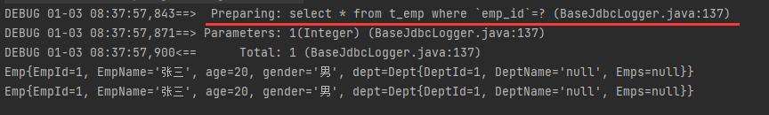
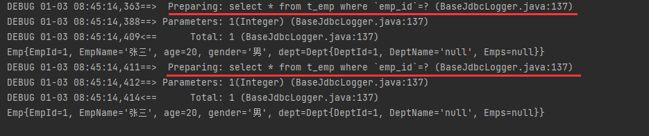
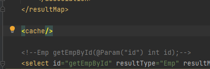
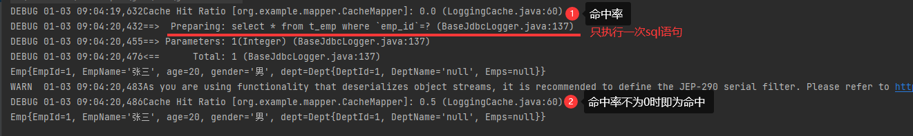

# 10、MyBatis的缓存

## 10.1、MyBatis的一级缓存

一级缓存是SqlSession级别的，通过同一个SqlSession查询的数据会被缓存，下次通过这个`SqlSession`查询相同的数据，就会从缓存中直接获取，不会从数据库重新访问

### 测试:

`默认开启`

log4j显示只执行了一次`sql`语句

```java
    @Test
    public void Cache1Test(){
        SqlSession sqlSession = SqlSessionUtil.getSqlSession();
        CacheMapper mapper = sqlSession.getMapper(CacheMapper.class);
        //下面的emp1&emp2都是同一个sqlsession创建的mapper查询出来的,所以只执行一次
        Emp emp1 = mapper.getEmpById(1);
        System.out.println(emp1);
        Emp emp2 = mapper.getEmpById(1);
        System.out.println(emp2);
        sqlSession.close();
    }
```

只执行一次`sql`



### 使一级缓存失效的四种情况：

1) 不同的SqlSession对应不同的一级缓存//sqlsession不同

2) 同一个SqlSession但是查询条件不同//使用的不同的sql语句

3) 同一个SqlSession两次查询期间执行了任何一次增删改操作//数据库更改所以需要重新查询

4) 同一个SqlSession两次查询期间手动清空了缓存`SqlSessionObj.clearCache`

```java
    @Test
    public void Cache1Test(){
        SqlSession sqlSession = SqlSessionUtil.getSqlSession();
        CacheMapper mapper = sqlSession.getMapper(CacheMapper.class);
        //下面的emp1&emp2都是同一个sqlsession创建的mapper查询出来的,所以只执行一次
        Emp emp1 = mapper.getEmpById(1);
        System.out.println(emp1);
        //清空缓存后,一级缓存失效
        sqlSession.clearCache();
        Emp emp2 = mapper.getEmpById(1);
        System.out.println(emp2);
        sqlSession.close();
    }
```

执行2次`sql`



## 10.2、MyBatis的二级缓存

二级缓存是**SqlSessionFactory级别**，通过同一个SqlSessionFactory创建的SqlSession查询的结果会被缓存；此后若再次执行相同的查询语句，结果就会从缓存中获取

二级缓存开启的**条件**：

a>在核心配置文件中，设置全局配置属性cacheEnabled="true"，默认为true，不需要设置

b>在映射文件中设置标签<cache/>



c>二级缓存必须在SqlSession关闭或提交之后有效

> SqlSession关闭或提交之前数据保存在一级缓存中
>
> 关闭或提交后数据从一级缓存转移到二级缓存中

d>查询的数据所转换的实体类类型必须实现序列化的接口

使二级缓存失效的情况：

> 两次查询之间执行了任意的增删改，会使一级和二级缓存同时失效
>
> SqlSession.clearCache只会使一级缓存失效

### 测试

```java
    @Test
    public void Cache2Test(){
        //下面是使用同一个factory创建的SqlSession
        SqlSession sqlSession1 = SqlSessionUtil.getSqlSession2();
        SqlSession sqlSession2 = SqlSessionUtil.getSqlSession2();
        CacheMapper mapper1 = sqlSession1.getMapper(CacheMapper.class);
        CacheMapper mapper2 = sqlSession2.getMapper(CacheMapper.class);
        
        Emp emp1 = mapper1.getEmpById(1);
        System.out.println(emp1);
        sqlSession1.commit();//ssqlSession.close(),缓存的提交
        Emp emp2 = mapper2.getEmpById(1);
        System.out.println(emp1);
    }
```



## 10.3、二级缓存的相关配置

在mapper配置文件中添加的cache标签可以设置一些属性：

缓存,即内存,不能无限制的存储数据

①eviction属性：缓存回收策略，默认的是 LRU。

```
LRU（Least Recently Used） – 最近最少使用的：移除最长时间不被使用的对象。

FIFO（First in First out） – 先进先出：按对象进入缓存的顺序来移除它们。

SOFT – 软引用：移除基于垃圾回收器状态和软引用规则的对象。

WEAK – 弱引用：更积极地移除基于垃圾收集器状态和弱引用规则的对象。
```

②flushInterval属性：刷新间隔，单位毫秒

```
默认情况是不设置，也就是没有刷新间隔，缓存仅仅调用语句时刷新
```

③size属性：引用数目，正整数

```
代表缓存最多可以存储多少个对象，太大容易导致内存溢出
```

④readOnly属性：只读， true/false

```
true：只读缓存；会给所有调用者返回缓存对象的相同实例。因此这些对象不能被修改。这提供了很重要的性能优势。

false：读写缓存；会返回缓存对象的拷贝（通过序列化）。这会慢一些，但是安全，因此默认是false。
```

## 10.4、MyBatis缓存查询的顺序

先查询二级缓存，因为二级缓存中可能会有其他程序已经查出来的数据，可以拿来直接使用。

如果二级缓存没有命中，再查询一级缓存

如果一级缓存也没有命中，则查询数据库

SqlSession关闭之后，一级缓存中的数据会写入二级缓存

## 10.5、整合第三方缓存EHCache

### 10.5.1、添加依赖

```xml
<!-- Mybatis EHCache整合包 -->
<dependency>
    <groupId>org.mybatis.caches</groupId>
    <artifactId>mybatis-ehcache</artifactId>
    <version>1.2.1</version>
</dependency>
<!-- slf4j日志门面的一个具体实现 -->
<dependency>
    <groupId>ch.qos.logback</groupId>
    <artifactId>logback-classic</artifactId>
    <version>1.2.3</version>
</dependency>
```

### 10.5.2、各jar包功能

| **jar包名称**   | **作用**                        |
| --------------- | ------------------------------- |
| mybatis-ehcache | Mybatis和EHCache的整合包        |
| ehcache         | EHCache核心包                   |
| slf4j-api       | SLF4J日志门面包                 |
| logback-classic | 支持SLF4J门面接口的一个具体实现 |

### 10.5.3、创建EHCache的配置文件ehcache.xml

```xml
<?xml version="1.0" encoding="utf-8" ?>
<ehcache xmlns:xsi="http://www.w3.org/2001/XMLSchema-instance"
xsi:noNamespaceSchemaLocation="../config/ehcache.xsd">
	<!-- 磁盘保存路径 -->
	<diskStore path="D:\atguigu\ehcache"/>
	<defaultCache
        maxElementsInMemory="1000"
        maxElementsOnDisk="10000000"
        eternal="false"
        overflowToDisk="true"
        timeToIdleSeconds="120"
        timeToLiveSeconds="120"
        diskExpiryThreadIntervalSeconds="120"
        memoryStoreEvictionPolicy="LRU">
	</defaultCache>
</ehcache>
```

### 10.5.4、设置二级缓存的类型

```xml
<cache type="org.mybatis.caches.ehcache.EhcacheCache"/>
```

### 10.5.5、加入logback日志

> 存在SLF4J时，作为简易日志的log4j将失效，此时我们需要借助SLF4J的具体实现logback来打印日志。 创建logback的配置文件logback.xml

```xml
<?xml version="1.0" encoding="UTF-8"?>
<configuration debug="true">
	<!-- 指定日志输出的位置 -->
	<appender name="STDOUT" class="ch.qos.logback.core.ConsoleAppender">
		<encoder>
            <!-- 日志输出的格式 -->
            <!-- 按照顺序分别是： 时间、日志级别、线程名称、打印日志的类、日志主体内容、换行-->
			<pattern>[%d{HH:mm:ss.SSS}] [%-5level] [%thread] [%logger][%msg]%n</pattern>
		</encoder>
	</appender>
    <!-- 设置全局日志级别。日志级别按顺序分别是： DEBUG、INFO、WARN、ERROR -->
    <!-- 指定任何一个日志级别都只打印当前级别和后面级别的日志。 -->
    <root level="DEBUG">
		<!-- 指定打印日志的appender，这里通过“STDOUT”引用了前面配置的appender -->
		<appender-ref ref="STDOUT" />
	</root>
	<!-- 根据特殊需求指定局部日志级别 -->
	<logger name="com.atguigu.crowd.mapper" level="DEBUG"/>
</configuration>
```

### 10.5.6、EHCache配置文件ehcache.xml说明

| **属性名**                      | **是否必须** | **作用**                                                     |
| ------------------------------- | ------------ | ------------------------------------------------------------ |
| maxElementsInMemory             | 是           | 在内存中缓存的element的最大数目                              |
| maxElementsOnDisk               | 是           | 在磁盘上缓存的element的最大数目，若是0表示无穷大             |
| eternal                         | 是           | 设定缓存的elements是否永远不过期。 如果为true，则缓存的数据始终有效， 如果为false那么还要根据timeToIdleSeconds、timeToLiveSeconds判断 |
| overflowToDisk                  | 是           | 设定当内存缓存溢出的时候是否将过期的element缓存到磁盘上      |
| timeToIdleSeconds               | 否           | 当缓存在EhCache中的数据前后两次访问的时间超过timeToIdleSeconds的属性取值时， 这些数据便会删除，默认值是0,也就是可闲置时间无穷大 |
| timeToLiveSeconds               | 否           | 缓存element的有效生命期，默认是0.,也就是element存活时间无穷大 |
| diskSpoolBufferSizeMB           | 否           | DiskStore(磁盘缓存)的缓存区大小。默认是30MB。每个Cache都应该有自己的一个缓冲区 |
| diskPersistent                  | 否           | 在VM重启的时候是否启用磁盘保存EhCache中的数据，默认是false。 |
| diskExpiryThreadIntervalSeconds | 否           | 磁盘缓存的清理线程运行间隔，默认是120秒。每个120s， 相应的线程会进行一次EhCache中数据的清理工作 |
| memoryStoreEvictionPolicy       | 否           | 当内存缓存达到最大，有新的element加入的时候， 移除缓存中element的策略。 默认是LRU （最近最少使用），可选的有LFU （最不常使用）和FIFO （先进先出） |