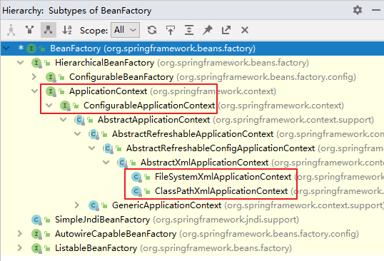
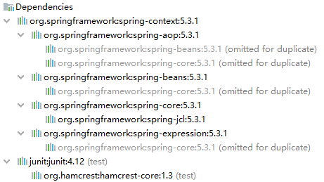
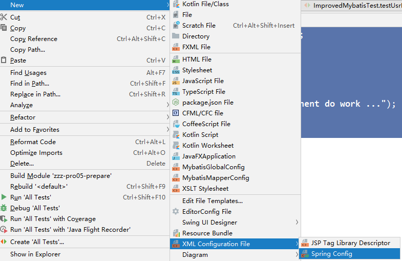
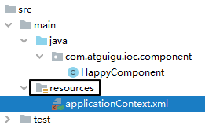
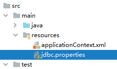
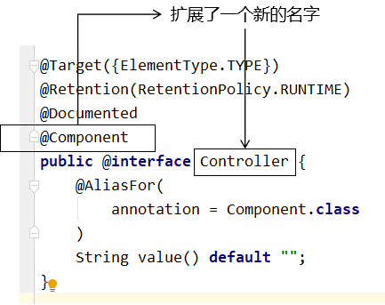

# 2、IOC

## 2.1、IOC容器

### 2.1.1、IOC思想

IOC：Inversion of Control，翻译过来是**反转控制**。指资源获取的方式

#### ①获取资源的传统方式

自己做饭：买菜、洗菜、择菜、改刀、炒菜，全过程参与，费时费力，必须清楚了解资源创建整个过程中的全部细节且熟练掌握。

在应用程序中的组件需要获取资源时，传统的方式是组件**主动**的从容器中获取所需要的资源，在这样的

模式下开发人员往往需要知道在具体容器中特定资源的获取方式，增加了学习成本，同时降低了开发效率。

#### ②反转控制方式获取资源

点外卖：下单、等、吃，省时省力，不必关心资源创建过程的所有细节。

反转控制的思想完全颠覆了应用程序组件获取资源的传统方式：反转了资源的获取方向——改由容器主动的将资源推送给需要的组件，开发人员不需要知道容器是如何创建资源对象的，只需要提供接收资源的方式即可，极大的降低了学习成本，提高了开发的效率。这种行为也称为查找的**被动**形式。

#### ③DI

DI：Dependency Injection，翻译过来是**依赖注入**。

DI 是 IOC 的另一种表述方式：即组件以一些预先定义好的方式（例如：setter 方法）接受来自于容器

的资源注入。相对于IOC而言，这种表述更直接。

所以结论是：IOC 就是一种反转控制的思想， 而 DI 是对 IOC 的一种具体实现。

### 2.1.2、IOC容器在Spring中的实现

Spring 的 IOC 容器就是 IOC 思想的一个落地的产品实现。IOC 容器中管理的组件也叫做 bean。在创建bean 之前，首先需要创建 IOC 容器。Spring 提供了 IOC 容器的两种实现方式：

#### ①BeanFactory

这是 IOC 容器的基本实现，是 Spring 内部使用的接口。面向 Spring 本身，不提供给开发人员使用。

#### ②ApplicationContext

BeanFactory 的子接口，提供了更多高级特性。面向 Spring 的使用者，几乎所有场合都使用

ApplicationContext 而不是底层的 BeanFactory。

#### ③ApplicationContext的主要实现类



| **类型名**                          | **简介**                                                     |
| :---------------------------------- | :----------------------------------------------------------- |
| ==ClassPathXmlApplicationContext==  | 通过读取==类路径==下的 XML 格式的配置文件创建 IOC 容器对象**(常用)** |
| ==FileSystemXmlApplicationContext== | 通过文件系统路径读取 XML 格式的配置文件创建 IOC 容器对象     |
| ConfigurableApplicationContext      | ApplicationContext 的子接口，包含一些扩展方法refresh() 和 close() ，让 ApplicationContext 具有启动、关闭和刷新上下文的能力。(启动关闭刷新容器) |
| WebApplicationContext               | 专门为 Web 应用准备，基于 Web 环境创建 IOC 容器对象，并将对象引入存入 ServletContext 域中。 |

## 2.2、基于XML管理bean

### 2.2.1、实验一：入门案例

#### ①创建Maven Module

#### ②引入依赖

```xml
<dependencies>
    <!-- 基于Maven依赖传递性，导入spring-context依赖即可导入当前所需所有jar包 -->
    <dependency>
        <groupId>org.springframework</groupId>
        <artifactId>spring-context</artifactId>
        <version>5.3.1</version>
    </dependency>
    <!-- junit测试 -->
    <dependency>
        <groupId>junit</groupId>
        <artifactId>junit</artifactId>
        <version>4.12</version>
        <scope>test</scope>
    </dependency>
</dependencies>
```



#### ③创建类HelloWorld

```java
public class HelloWorld {
    public void sayHello(){
        System.out.println("helloworld");
    }
}
```





#### ⑤在Spring的配置文件中配置bean

```xml
<!--
	配置HelloWorld所对应的bean，即将HelloWorld的对象交给Spring的IOC容器管理
	通过bean标签配置IOC容器所管理的bean
	属性：
		id：设置bean的唯一标识,唯一即可
		class：设置bean所对应类型的全类名
-->
<bean id="helloworld" class="com.atguigu.spring.bean.HelloWorld"></bean>
```

#### ⑥创建测试类测试

```java
@Test
public void testHelloWorld(){
    //获取IOC容器,填写类路径
    //resource和java最后都合并到同一个目录中.所以可以直接访问
    ApplicationContext ac = new ClassPathXmlApplicationContext("applicationContext.xml");
    //获取bean类实例,参数为bean的唯一标识,调用无参构造器
    //也可以使用getBean(String id,Object...args),并强制转换为HelloWorld
    HelloWorld helloworld = (HelloWorld) ac.getBean("helloworld");
    //使用方法
    helloworld.sayHello();
}
```

#### ⑦思路


重点就是在**Spring配置文件中进行配置**，而后根据配置文件获取IOC容器，使用IOC容器创建Bean调用方法

#### ⑧注意:无参构造器

Spring 底层默认通过反射技术调用组件类的无参构造器来创建组件对象，这一点需要注意。如果在需要无参构造器时，没有无参构造器，则会抛出下面的异常：

> org.springframework.beans.factory.**BeanCreationException**: 
> Error creating bean with name 'helloworld' defined in class path resource 
> [applicationContext.xml]: Instantiation of beanfailed; 
> nested exception嵌套异常 is org.springframework.beans.**BeanInstantiationException**: 
> Failed to instantiate 
> [com.atguigu.spring.bean.HelloWorld]: **No default constructor found**; 
> nested exception is java.lang.**NoSuchMethodException**: com.atguigu.spring.bean.HelloWorld.<init>()缺少无参构造器

在反射中非常常用,必须要有

### 2.2.2、实验二：获取bean

IOC获取bean对象实例默认是单例的，但是可以通过设置bean标签中的某个属性来设置为多例

IOC创建对象的方式`工厂模式`+`反射`

```java
getBean(Stirng BeanId)
getBean(Class<T>requiredType)
getBean(String BeanId,Class<T>requiredType)//将id和类型作为主键进行唯一指定
```

#### ①方式一：根据id获取

由于 id 属性指定了 bean 的唯一标识，所以根据 bean 标签的 id 属性可以精确获取到一个组件对象。

上个实验中我们使用的就是这种方式。

#### ②方式二：根据类型获取(最常用)

```java
@Test
public void testHelloWorld(){
    ApplicationContext ac = new ClassPathXmlApplicationContext("applicationContext.xml");
    HelloWorld bean = ac.getBean(HelloWorld.class);
    bean.sayHello();
}
```

#### ③方式三：根据id和类型

```java
@Test
public void testHelloWorld(){
    ApplicationContext ac = newClassPathXmlApplicationContext("applicationContext.xml");
    HelloWorld bean = ac.getBean("helloworld", HelloWorld.class);
    bean.sayHello();
}
```

#### ④注意

当根据类型获取bean时，要求IOC容器中指定类型的bean有且只能有一个

即一个BeanId对应一个类,不允许BeanId和类为多对一的关系

如果为多对一的关系,则在根据类型获取bean的时候抛出**`NoUniqueBeanDefinitionException`**异常

如果为0对一的关系,则在根据类型获取bean的时候抛出**`NoSuchBeanDefinitionException`**异常

当IOC容器中一共配置了两个：

```xml
<bean id="helloworldOne" class="com.atguigu.spring.bean.HelloWorld"></bean>
<bean id="helloworldTwo" class="com.atguigu.spring.bean.HelloWorld"></bean>
```

根据类型获取时会抛出异常：

> org.springframework.beans.factory.**NoUniqueBeanDefinitionException**: 
> No qualifying beanof type 'com.atguigu.spring.bean.HelloWorld' available: expected single matching bean 
> but found 2: helloworldOne,helloworldTwo

#### ⑤扩展


如果组件类实现了接口，根据接口类型可以获取 bean 吗？

> 可以，前提是bean唯一
>
> ```xml
> <?xml version="1.0" encoding="UTF-8"?>
> <beans ...>
>     <bean id="student1" class="com.aoidayo.pojo.Student"></bean>
> </beans>
> ```

```java
    @Test
    public void testStudent(){
        ApplicationContext ioc=new ClassPathXmlApplicationContext("applicationContext.xml");
        //根据接口的实现类在Bean标签的class中查找是否存在一个实现类
        Person person = ioc.getBean(Person.class);
        System.out.println(person);
        //Student{sid=null, sname='null', age=null, gender='null'}
    }
```

如果一个接口有多个实现类，这些实现类都配置了 bean，根据接口类型可以获取 bean 吗？

> 不行，因为bean不唯一
>
> ```xml
> <?xml version="1.0" encoding="UTF-8"?>
> <beans ...>
>     <bean id="student1" class="com.aoidayo.pojo.Student"></bean>
>     <bean id="student2" class="com.aoidayo.pojo.Student1"></bean>
>     <bean id="student3" class="com.aoidayo.pojo.Student2"></bean>
> </beans>
> ```
>
> 抛出`NoUniqueBeanDefinitionException`异常

#### ⑥结论

根据类型来获取bean时，在满足bean唯一性的前提下，其实只是看：『对象 **instanceof** 指定的类型』的返回结果，只要返回的是true就可以认定为和类型匹配，能够获取到。

即通过bean的类型、bean所继承的类的类型、bean所实现的接口的类型都可以获取bean的实例。

### DI部分

### 2.2.3、实验三：依赖注入之setter注入

#### ①创建学生类Student

```java
public class Student {
    //student依赖属性
    //依赖注入就是为student的属性赋值的过程
    //进行set注入
    private Integer id;
    private String name;
    private Integer age;
    private String sex;
    public Student() {
    }
    public Integer getId() {
        return id;
    }
    public void setId(Integer id) {
        this.id = id;
    }
    public String getName() {
        return name;
    }
    public void setName(String name) {
        this.name = name;
    }
    public Integer getAge() {
        return age;
    }
    public void setAge(Integer age) {
        this.age = age;
    }
    public String getSex() {
        return sex;
    }
    public void setSex(String sex) {
        this.sex = sex;
    }
    @Override
    public String toString() {
        return "Student{" +
            "id=" + id +
            ", name='" + name + '\'' +
            ", age=" + age +
            ", sex='" + sex + '\'' +
            '}';
    }
}
```

#### ②配置bean时为属性赋值

```xml
<bean id="studentOne" class="com.atguigu.spring.bean.Student">
    <!-- property标签：通过组件类的setXxx()方法给组件对象设置属性 -->
    <!-- name属性：指定属性名（这个属性名是getXxx()、setXxx()方法定义的，和成员变量无关）-->
    <!-- value属性：指定属性值 -->
    <!-- ref属性：指定引用值 -->
    <property name="id" value="1001"></property>
    <property name="name" value="张三"></property>
    <property name="age" value="23"></property>
    <property name="sex" value="男"></property>
</bean>
```

#### ③测试

```java
@Test
public void testDIBySet(){
    ApplicationContext ac = new ClassPathXmlApplicationContext("springdi.xml");
    Student studentOne = ac.getBean("studentOne", Student.class);
    System.out.println(studentOne);
}
```

### 2.2.4、实验四：依赖注入之构造器注入

#### ①在Student类中添加有参构造

```java
public Student(Integer id, String name, Integer age, String sex) {
    this.id = id;
    this.name = name;
    this.age = age;
    this.sex = sex;
}
```

#### ②配置bean

```xml
<bean id="studentTwo" class="com.atguigu.spring.bean.Student">
    <constructor-arg value="1002"></constructor-arg>
    <constructor-arg value="李四"></constructor-arg>
    <constructor-arg value="33"></constructor-arg>
    <constructor-arg value="女" name="gender"></constructor-arg>
</bean>
```

若同时

> 注意：
>
> constructor-arg标签还有两个属性可以进一步描述构造器参数：
>
> - index属性：指定参数所在位置的索引（从0开始）
> - name属性：指定参数名,在存在相同个数的参数构造器时需要指定参数名

#### ③测试

```java
@Test
public void testDIBySet(){
    ApplicationContext ac = new ClassPathXmlApplicationContext("springdi.xml");
    Student studentOne = ac.getBean("studentTwo", Student.class);
    System.out.println(studentOne);
}
```

### 2.2.5、实验五：DI之特殊值处理

#### ①字面量赋值

> 什么是字面量？
>
> int a = 10;
>
> 声明一个变量a，初始化为10，此时a就不代表字母a了，而是作为一个变量的名字。当我们引用a的时候，我们实际上拿到的值是10。
>
> 而如果a是带引号的：'a'，那么它现在不是一个变量，它就是代表a这个字母本身，这就是字面量。
>
> 所以字面量没有引申含义，就是我们看到的这个数据本身。

```xml
<!-- 使用value属性给bean的属性赋值时，Spring会把value属性的值看做字面量 -->
<property name="name" value="张三"/>
```

#### ②null值

```xml
<property name="name">
	<null />
</property>
```

> 注意：
>
> ```xml
> <property name="name" value="null"></property>
> ```
>
> 以上写法，为name所赋的值是字符串null

#### ③xml实体

```xml
<!-- 小于号在XML文档中用来定义标签的开始，不能随便使用 -->
<!-- 解决方案一：使用XML实体来代替 -->
<property name="expression" value="a &lt; b"/>
<!--
 	< : &lt;
  	> : &gt;
-->
```

#### ④CDATA节

不能写在标签的属性中,只能作为标签编写

```xml
<property name="expression">
    <!-- 解决方案二：使用CDATA节 -->
    <!-- CDATA中的C代表Character，是文本、字符的含义，CDATA就表示纯文本数据 -->
    <!-- XML解析器看到CDATA节就知道这里是纯文本，就不会当作XML标签或属性来解析 -->
    <!-- 所以CDATA节中写什么符号都随意 -->
    <value><![CDATA[a < b]]></value>
</property>
```

### 2.2.6、实验六：DI之为类类型属性赋值

#### ①创建班级类Clazz

```java
public class Clazz {
    private Integer clazzId;
    private String clazzName;
    public Integer getClazzId() {
        return clazzId;
    }
    public void setClazzId(Integer clazzId) {
        this.clazzId = clazzId;
    }
    public String getClazzName() {
        return clazzName;
    }
    public void setClazzName(String clazzName) {
        this.clazzName = clazzName;
    }
    @Override
    public String toString() {
        return "Clazz{" +
            "clazzId=" + clazzId +
            ", clazzName='" + clazzName + '\'' +
            '}';
    }
    public Clazz() {
    }
    public Clazz(Integer clazzId, String clazzName) {
        this.clazzId = clazzId;
        this.clazzName = clazzName;
    }
}
```

#### ②修改Student类

在Student类中添加以下代码：

```java
private Clazz clazz;
public Clazz getClazz() {
    return clazz;
}
public void setClazz(Clazz clazz) {
    this.clazz = clazz;
}
//修改toString()方法
```

#### ③方式一：引用外部已声明的bean(比较常用)

配置Clazz类型的bean：

```xml
<bean id="clazzOne" class="com.atguigu.spring.bean.Clazz">
    <property name="clazzId" value="1111"></property>
    <property name="clazzName" value="财源滚滚班"></property>
</bean>
```

为Student中的clazz属性赋值：

```xml
<bean id="studentFour" class="com.atguigu.spring.bean.Student">
    <property name="id" value="1004"></property>
    <property name="name" value="赵六"></property>
    <property name="age" value="26"></property>
    <property name="sex" value="女"></property>
    <!-- ref属性：引用IOC容器中某个bean的id，将所对应的bean为属性赋值 -->
    <property name="clazz" ref="clazzOne"></property>
</bean>
```

错误演示：

```xml
<bean id="studentFour" class="com.atguigu.spring.bean.Student">
    <property name="id" value="1004"></property>
    <property name="name" value="赵六"></property>
    <property name="age" value="26"></property>
    <property name="sex" value="女"></property>
    <property name="clazz" value="clazzOne"></property>
</bean>
```

> 如果错把ref属性写成了value属性，会抛出异常： Caused by: java.lang.IllegalStateException:
>
> Cannot convert value of type 'java.lang.String' to required type
>
> 'com.atguigu.spring.bean.Clazz' for property 'clazz': no matching editors or conversion
>
> strategy found
>
> 意思是不能把String类型转换成我们要的Clazz类型，说明我们使用value属性时，Spring只把这个
>
> 属性看做一个普通的字符串，不会认为这是一个bean的id，更不会根据它去找到bean来赋值

#### ④方式二：内部bean(常用)

```xml
<bean id="studentFour" class="com.atguigu.spring.bean.Student">
    <property name="id" value="1004"></property>
    <property name="name" value="赵六"></property>
    <property name="age" value="26"></property>
    <property name="sex" value="女"></property>
    <property name="clazz">
        <!-- 在一个bean中再声明一个bean就是内部bean -->
        <!-- 内部bean只能用于给属性赋值，不能在外部通过IOC容器获取，因此可以省略id属性 -->
        <bean id="clazzInner" class="com.atguigu.spring.bean.Clazz">
            <property name="clazzId" value="2222"></property>
            <property name="clazzName" value="远大前程班"></property>
        </bean>
    </property>
</bean>
```

#### ③方式三：级联属性赋值

特点在于可以使用不同于引用的bean内设置的值,可以自定义一个值修改引用的bean的值

```xml
<bean id="studentFour" class="com.atguigu.spring.bean.Student">
    <property name="id" value="1004"></property>
    <property name="name" value="赵六"></property>
    <property name="age" value="26"></property>
    <property name="sex" value="女"></property>
    <!-- 一定先引用某个bean为属性赋值，才可以使用级联方式更新属性 -->
    <property name="clazz" ref="clazzOne"></property>
    <property name="clazz.clazzId" value="3333"></property>
    <property name="clazz.clazzName" value="最强王者班"></property>
</bean>
```

### 2.2.7、实验七：DI之为数组类型属性赋值

#### ①修改Student类

在Student类中添加以下代码：

```java
private String[] hobbies;
public String[] getHobbies() {
    return hobbies;
}
public void setHobbies(String[] hobbies) {
    this.hobbies = hobbies;
}
```

#### ②配置bean

```xml
<bean id="studentFour" class="com.atguigu.spring.bean.Student">
    <property name="id" value="1004"></property>
    <property name="name" value="赵六"></property>
    <property name="age" value="26"></property>
    <property name="sex" value="女"></property>
    <!-- ref属性：引用IOC容器中某个bean的id，将所对应的bean为属性赋值 -->
    <property name="clazz" ref="clazzOne"></property>
    <property name="hobbies">
        <array>
            <!--
			array标签:内部子标签有value和ref
      		字面量类型:value
			类类型:ref	
			-->
            <ref bean="clazzOne"></ref>
            <value>抽烟</value>
            <value>喝酒</value>
            <value>烫头</value>
        </array>
    </property>
</bean>
```

### 2.2.8、实验八：DI之为集合类型属性赋值

#### ①为List集合类型属性赋值

在Clazz类中添加以下代码：

```java
private List<Student> students;
public List<Student> getStudents() {
    return students;
}
public void setStudents(List<Student> students) {
    this.students = students;
}
```

配置bean：

```xml
<bean id="clazzTwo" class="com.atguigu.spring.bean.Clazz">
    <property name="clazzId" value="4444"></property>
    <property name="clazzName" value="Javaee0222"></property>
    <property name="students">
        <!--1.内部list集合
		X 2.引用list集合类型的Bean
		-->
        <list>
            <ref bean="studentOne"></ref>
            <ref bean="studentTwo"></ref>
            <ref bean="studentThree"></ref>
        </list>
    </property>
</bean>
```

> 若为Set集合类型属性赋值，只需要将其中的list标签改为set标签即可

配置一个集合类型的bean,使用util约束的标签`<util:list>`来建立一个`List`类型的`JavaBean`

**util约束**:`xmlns:util="http://www.springframework.org/schema/util"`

```xml
    <!--配置一个集合类型的bean,需要引入一个util的约束-->
    <util:list id="studentList">
        <ref bean="student1"></ref>
        <ref bean="student2"></ref>
        <ref bean="student3"></ref>
    </util:list>

    <bean id="clazz3" class="com.aoidayo.pojo.Clazz">
        <property name="cid" value="1"></property>
        <property name="cname" value="三一班"></property>
        <property name="students" ref="studentList"></property>
    </bean>
```

#### ②为Map集合类型属性赋值

创建教师类Teacher：

```java
public class Teacher {
    private Integer teacherId;
    private String teacherName;
    public Integer getTeacherId() {
        return teacherId;
    }
    public void setTeacherId(Integer teacherId) {
        this.teacherId = teacherId;
    }
    public String getTeacherName() {
        return teacherName;
    }
    public void setTeacherName(String teacherName) {
        this.teacherName = teacherName;
    }
    public Teacher(Integer teacherId, String teacherName) {
        this.teacherId = teacherId;
        this.teacherName = teacherName;
    }
    public Teacher() {
    }
    @Override
    public String toString() {
        return "Teacher{" +
            "teacherId=" + teacherId +
            ", teacherName='" + teacherName + '\'' +
            '}';
    }
}
```

在Student类中添加以下代码：

```java
private Map<String, Teacher> teacherMap;
public Map<String, Teacher> getTeacherMap() {
    return teacherMap;
}
public void setTeacherMap(Map<String, Teacher> teacherMap) {
    this.teacherMap = teacherMap;
}
```

配置bean：

```xml
<bean id="teacherOne" class="com.atguigu.spring.bean.Teacher">
    <property name="teacherId" value="10010"></property>
    <property name="teacherName" value="大宝"></property>
</bean>
<bean id="teacherTwo" class="com.atguigu.spring.bean.Teacher">
    <property name="teacherId" value="10086"></property>
    <property name="teacherName" value="二宝"></property>
</bean>
<bean id="studentFour" class="com.atguigu.spring.bean.Student">
    <property name="id" value="1004"></property>
    <property name="name" value="赵六"></property>
    <property name="age" value="26"></property>
    <property name="sex" value="女"></property>
    <!-- ref属性：引用IOC容器中某个bean的id，将所对应的bean为属性赋值 -->
    <property name="clazz" ref="clazzOne"></property>
    <property name="hobbies">
        <array>
            <value>抽烟</value>
            <value>喝酒</value>
            <value>烫头</value>
        </array>
    </property>
    <property name="teacherMap">
        <map>
            <!--
            entry属性:
            	key:字面量的键
        		key-ref:引用类型的键
            	value:字面量的值
            	value-ref:引用类型的值
			-->
            <entry key="10086" value-ref="teacherOne"></entry>
            <entry>
                <key>
                    <value>10010</value>
                </key>
                <ref bean="teacherOne"></ref>
            </entry>
            <entry>
                <key>
                    <value>10086</value>
                </key>
                <ref bean="teacherTwo"></ref>
            </entry>
        </map>
    </property>
</bean>
```

#### ③引用集合类型的bean

使用`<util:map>`设置`map`类型的`bean`

```xml
<!--list集合类型的bean-->
<util:list id="students">
    <ref bean="studentOne"></ref>
    <ref bean="studentTwo"></ref>
    <ref bean="studentThree"></ref>
</util:list>
<!--map集合类型的bean-->
<util:map id="teacherMap">
    <entry>
        <key>
            <value>10010</value>
        </key>
        <ref bean="teacherOne"></ref>
    </entry>
    <entry>
        <key>
            <value>10086</value>
        </key>
        <ref bean="teacherTwo"></ref>
    </entry>
</util:map>

<bean id="studentFour" class="com.atguigu.spring.bean.Student">
    <property name="id" value="1004"></property>
    <property name="name" value="赵六"></property>
    <property name="age" value="26"></property>
    <property name="sex" value="女"></property>
    <!-- ref属性：引用IOC容器中某个bean的id，将所对应的bean为属性赋值 -->
    <property name="clazz" ref="clazzOne"></property>
    <property name="hobbies">
        <array>
            <value>抽烟</value>
            <value>喝酒</value>
            <value>烫头</value>
        </array>
    </property>
    <property name="teacherMap" ref="teacherMap"></property>
</bean>
```

> 使用util:list、util:map标签必须引入相应的命名空间，可以通过idea的提示功能选择

使用内部bean设置键值对中的值

```xml
    <util:map id="teacherMap">
        <entry>
            <key>
                <value>软件工程老师</value>
            </key>
            <bean class="com.aoidayo.pojo.Teacher">
                <property name="tid" value="1"></property>
                <property name="tname" value="张磊2"></property>
            </bean>
        </entry>
    </util:map>

    <bean id="student6" class="com.aoidayo.pojo.Student">
        <property name="sid" value="1"></property>
        <property name="sname" value="徐向阳"></property>
        <property name="age" value="16"></property>
        <property name="gender" value="男"></property>
        <property name="clazz">
            <bean class="com.aoidayo.pojo.Clazz">
                <property name="cid" value="1"></property>
                <property name="cname" value="三一班"></property>
            </bean>
        </property>
        <property name="hobby">
            <array>
                <value>唱</value>
                <value>跳</value>
                <value>rap</value>
                <value>打篮球</value>
            </array>
        </property>
        <property name="teacherMap" ref="teacherMap"></property>
    </bean>
```

```java
    /**
     * 测试注入Map
     */
    @Test
    public void testIOCbyMap(){
        ApplicationContext ioc=new ClassPathXmlApplicationContext("applicationContext.xml");

        Student student6 = ioc.getBean("student6", Student.class);
        System.out.println(student6);
        /*
         Student{sid=1, sname='徐向阳', age=16, gender='男',
                clazz=Clazz{cid=1, cname='三一班', students=null},
                hobby=[唱, 跳, rap, 打篮球],
                teacherMap={数学老师=Teacher{tid=1, tname='张磊2'}}}
         */
    }
```

### 2.2.9、实验九：DI之p命名空间

引入p命名空间后，可以通过以下方式为bean的各个属性赋值

**p约束**:`xmlns:p="http://www.springframework.org/schema/p"`

```xml
<bean id="studentSix" class="com.atguigu.spring.bean.Student"
      p:id="1006" p:name="小明" p:clazz-ref="clazzOne" p:teacherMap-ref="teacherMap"></bean>
```

### Spring管理数据库

也是通过数据源进行连接的获取的

数据源DataSource是一个接口,所以我们在xml配置文件中配置的类是其实现类`DruidDataSource`

#### ①bean配置

`ctrl+shift+z`符号大全

```xml
    <bean id="druidDataSource" class="com.alibaba.druid.pool.DruidDataSource">
        <property name="driverClassName" value="com.mysql.cj.jdbc.Driver"></property>
        <property name="url" value="jdbc:mysql://localhost:3306/ssm?serverTimezone=UTC"></property>
        <property name="username" value="root"></property>
        <property name="password" value="root"></property>
    </bean>
```

#### ②编写test函数测试

```java
    @Test
    public void TestDruid(){
        ApplicationContext ioc=new ClassPathXmlApplicationContext("spring-datasource.xml");
        //使用其父接口获取DruidDataSource
        DataSource dataSource=ioc.getBean(DataSource.class);
        Connection connection=null;
        try {
            connection = dataSource.getConnection();
        } catch (SQLException e) {
            throw new RuntimeException(e);
        }
        System.out.println(connection);
        //com.mysql.cj.jdbc.ConnectionImpl@482cd91f
    }
```

### 2.2.10、实验十：引入外部属性文件

#### ①加入依赖

```xml
<!-- MySQL驱动 -->
<dependency>
    <groupId>mysql</groupId>
    <artifactId>mysql-connector-java</artifactId>
    <version>8.0.16</version>
</dependency>
<!-- 数据源 -->
<dependency>
    <groupId>com.alibaba</groupId>
    <artifactId>druid</artifactId>
    <version>1.0.31</version>
</dependency>
```

#### ②创建外部属性文件



为避免多个properties文件中重复出现的键,在键前面添加一个前缀以免重复

```properties
jdbc.user=root
jdbc.password=atguigu
jdbc.url=jdbc:mysql://localhost:3306/ssm?serverTimezone=UTC
jdbc.driver=com.mysql.cj.jdbc.Driver
```

#### ③引入属性文件

旧版本的方法可以通过一个bean引入


```xml
<!-- 引入外部属性文件jdbc.properties -->
<!-- 需要引入新的约束 -->
<context:property-placeholder location="classpath:jdbc.properties"/>
```

#### ④配置bean

```xml
<bean id="druidDataSource" class="com.alibaba.druid.pool.DruidDataSource">
    <property name="url" value="${jdbc.url}"/>
    <property name="driverClassName" value="${jdbc.driver}"/>
    <property name="username" value="${jdbc.user}"/>
    <property name="password" value="${jdbc.password}"/>
</bean>
```

#### ⑤测试

```java
@Test
public void testDataSource() throws SQLException {
    ApplicationContext ac = new ClassPathXmlApplicationContext("spring-datasource.xml");
    //使用父类接口类型获取druidDatasource
    DataSource dataSource = ac.getBean(DataSource.class);
    Connection connection = dataSource.getConnection();
    System.out.println(connection);
}
```

### 2.2.11、实验十一：bean的作用域

#### ①概念

在Spring中可以通过配置bean标签的**`scope`**属性来指定bean的作用域范围，各取值含义参加下表：

| **取值**               | **含义**                                                     | **创建对象的时机**        |
| ---------------------- | ------------------------------------------------------------ | ------------------------- |
| singleton（默认,单例） | 在IOC容器中，这个bean的对象始终为单实例<br />即获取的对象都是一个对象 | IOC容器初始化时(new IOC)  |
| prototype  (多例)      | 这个bean在IOC容器中有多个实例                                | 获取bean时(IOC.getBean()) |

如果是在WebApplicationContext环境下还会有另外两个作用域（但不常用）：

| **取值** | **含义**                                        |
| -------- | ----------------------------------------------- |
| request  | 在一个请求范围内有效                            |
| session  | 在一个会话范围内有效(会话,打开网页到关闭浏览器) |

#### ②创建类User

```java
public class User {
    private Integer id;
    private String username;
    private String password;
    private Integer age;
}
```

#### ③配置bean

```xml
<!-- scope属性：取值singleton（默认值），bean在IOC容器中只有一个实例，IOC容器初始化时创建对象 -->
<!-- scope属性：取值prototype，bean在IOC容器中可以有多个实例，getBean()时创建对象 -->
<bean class="com.atguigu.bean.User" scope="prototype"></bean>
```

#### ④测试

```java
@Test
public void testBeanScope(){
    ApplicationContext ac = new ClassPathXmlApplicationContext("spring-scope.xml");
	//scope="singleton"
    User user1 = ac.getBean(User.class);
    User user2 = ac.getBean(User.class);
    System.out.println(user1==user2);//true
    //也可以使用.equals,如果重写了equals则必须通过hashCode判断是否为同一个对象
}
```

```java
@Test
public void testBeanScope(){
    ApplicationContext ac = new ClassPathXmlApplicationContext("spring-scope.xml");
	//scope="prototype"
    User user1 = ac.getBean(User.class);
    User user2 = ac.getBean(User.class);
    System.out.println(user1==user2);//false
}
```

### 2.2.12、实验十二：bean的生命周期

#### ①具体的生命周期过程

- bean对象创建实例化（工厂模式与反射,调用无参构造器）
- 给bean对象设置属性(使用setter方法依赖注入)
  - bean对象初始化之前操作（由bean的后置处理器负责）

- bean对象初始化（需在配置bean时指定初始化方法initMethod）
  - bean对象初始化之后操作（由bean的后置处理器负责）
  - bean对象就绪可以**使用**

- bean对象销毁（需在配置bean时指定销毁方法destoryMethod,在IOC容器关闭时销毁）
  - IOC容器关闭


简化版:


#### ②修改类User

```java
public class User {
    private Integer id;
    private String username;
    private String password;
    private Integer age;
    public User() {
        System.out.println("生命周期：1、创建对象");
    }
    public User(Integer id, String username, String password, Integer age) {
        this.id = id;
        this.username = username;
        this.password = password;
        this.age = age;
    }
    public Integer getId() {
        return id;
    }
    public void setId(Integer id) {
        System.out.println("生命周期：2、依赖注入");
        this.id = id;
    }
    public String getUsername() {
        return username;
    }
    public void setUsername(String username) {
        this.username = username;
    }
    public String getPassword() {
        return password;
    }
    public void setPassword(String password) {
        this.password = password;
    }
    public Integer getAge() {
        return age;
    }
    public void setAge(Integer age) {
        this.age = age;
    }
    public void initMethod(){
        System.out.println("生命周期：3、初始化");
    }
    public void destroyMethod(){
        System.out.println("生命周期：5、销毁");
    }
    @Override
    public String toString() {
        return "User{" +
            "id=" + id +
            ", username='" + username + '\'' +
            ", password='" + password + '\'' +
            ", age=" + age +
            '}';
    }
}
```

> 注意其中的initMethod()和destroyMethod()，可以通过配置bean指定为初始化和销毁的方法

#### ③配置bean

```xml
<!-- 使用init-method属性指定初始化方法 -->
<!-- 使用destroy-method属性指定销毁方法 -->
<bean class="com.atguigu.bean.User" scope="prototype" init-method="initMethod" destroy-method="destroyMethod">
    <property name="id" value="1001"></property>
    <property name="username" value="admin"></property>
    <property name="password" value="123456"></property>
    <property name="age" value="23"></property>
</bean>
```

#### ④测试

```java
@Test
public void testLife(){
    ClassPathXmlApplicationContext ac = newClassPathXmlApplicationContext("spring-lifecycle.xml");
    User bean = ac.getBean(User.class);
    System.out.println("生命周期：4、通过IOC容器获取bean并使用");
    //ApplicationContext中不提供close方法,需要更改为ConfigurableContext/ClassPathXmlApplicationContext
    //ConfigurableContext是ApplicationContext子接口,加入了刷新和关闭的方法
    ac.close();
}
```

#### 不同的作用域其生命周期也不同

```
//bean为单例作用域
在创建IOC容器时就进行Bean的实例化依赖注入和初始化
//bean为多例作用域
在使用IOC容器getBean的时候才进行实例化依赖注入和初始化
但是在容器关闭时,bean的销毁没有执行,即其销毁方法不是由IOC容器管理
```

#### ⑤bean的后置处理器

bean的后置处理器会在生命周期的**初始化前后**添加额外的操作，
需要实现BeanPostProcessor接口，且配置到IOC容器中，
需要注意的是，bean后置处理器不是单独针对某一个bean生效，而是**针对IOC容器中所有bean**都会执行

创建bean的后置处理器：

```java
package com.atguigu.spring.process;
import org.springframework.beans.BeansException;
import org.springframework.beans.factory.config.BeanPostProcessor;
//实现BeanPostProcessor接口
public class MyBeanProcessor implements BeanPostProcessor {
    //重载postProcessBeforeInitialization和postProcessAfterInitialization方法
    @Override
    public Object postProcessBeforeInitialization(Object bean, String beanName)
        throws BeansException {
        //此方法在bean生命周期的初始化之前执行
        //参数:bean为IOC容器管理的bean,beanName即为xml配置文件中bean的ID
        System.out.println("☆☆☆" + beanName + " = " + bean);
        //返回Bean
        return bean;
    }
    @Override
    public Object postProcessAfterInitialization(Object bean, String beanName)
        throws BeansException {
        //此方法在bean生命周期的初始化之后执行
        System.out.println("★★★" + beanName + " = " + bean);
        return bean;
    }
}
```

在IOC容器中配置后置处理器：

> <!-- bean的后置处理器要放入IOC容器才能生效 -->
>
> <!---->
>
> <bean id="myBeanProcessor" class="com.atguigu.spring.process.MyBeanProcessor"/>

### 2.2.13、实验十三：FactoryBean(常用)

#### ①简介

FactoryBean是Spring提供的一种整合第三方框架的常用机制。和普通的bean不同，配置一个

FactoryBean类型的bean，在获取bean的时候得到的并不是class属性中配置的这个类的对象，而是

getObject()方法的返回值。通过这种机制，Spring可以帮我们把复杂组件创建的详细过程和繁琐细节都屏蔽起来，只把最简洁的使用界面展示给我们。

==**将来我们整合Mybatis时，Spring就是通过FactoryBean机制来帮我们创建SqlSessionFactory对象的。**==

> FactoryBean是一个接口，需要创建一个类实现该接口其中有三个方法:
>
> getobject():提供一个对象交给IoC容器管理
> getobjectType():设置所提供对象的类型
> issingleton():所提供的对象是否单例
>
> 当把FactoryBean的实现类配置为bean时，会将当前类中getobject()所返回的对象交给IOC容器管理

```java
public interface FactoryBean<T> {

    String OBJECT_TYPE_ATTRIBUTE = "factoryBeanObjectType";
 
    @Nullable
    T getObject() throws Exception;
 
    @Nullable
    Class<?> getObjectType();
 
    default boolean isSingleton() {
        return true;
    }
}
```

#### ②创建类UserFactoryBean

```java
public class UserFactoryBean implements FactoryBean<User> {
    @Override
    public User getObject() throws Exception {
        return new User();
    }
    @Override
    public Class<?> getObjectType() {
        return User.class;
    }
}
```

#### ③创建配置文件springfactorybean.xml,配置bean

```xml
<bean id="user" class="com.atguigu.bean.UserFactoryBean"></bean>
```

#### ④测试

```java
@Test
public void testUserFactoryBean(){
    //获取IOC容器
    //单例时:获取IOC容器时实际上是将factoryBean的getObject的返回对象交给IOC容器管理
    //而不是将UserFactoryBean交给IOC管理
    ApplicationContext ac = new ClassPathXmlApplicationContext("springfactorybean.xml");
    //多例时:获取bean的时候实际上是将factoryBean的getObject的返回值返回
    //User user = (User) ac.getBean("user");
    
    //使用User.class获取bean,没有配置User但是可以获取
    User user = (User) ac.getBean(User.class);
    System.out.println(user);
}
```

### 2.2.14、实验十四：基于xml的自动装配

> 自动装配：
>
> 根据指定的策略，在IOC容器中匹配某一个bean，自动为指定的bean中`所依赖`的类类型或接口类型属性赋值
>

#### ①场景模拟

创建类UserController

```java
public class UserController {
    private UserService userService;
    public void setUserService(UserService userService) {
        this.userService = userService;
    }
    public void saveUser(){
        userService.saveUser();
    }
}
```

创建接口UserService

```java
public interface UserService {
	void saveUser();
}
```

创建类UserServiceImpl实现接口UserService

```java
public class UserServiceImpl implements UserService {
    private UserDao userDao;
    public void setUserDao(UserDao userDao) {
        this.userDao = userDao;
    }
    @Override
    public void saveUser() {
        userDao.saveUser();
    }
}
```

创建接口UserDao

```java
public interface UserDao {
	void saveUser();
}
```

创建类UserDaoImpl实现接口UserDao

```java
public class UserDaoImpl implements UserDao {
    @Override
    public void saveUser() {
        System.out.println("保存成功");
    }
}
```

#### 环境模拟的bean配置

> 下面是我们进行手动装配,进行手动的set注入

```xml
    <bean class="com.aoidayo.controller.UserController">
        <property name="userservice" ref="userService"></property>
    </bean>
    <bean id="userService" class="com.aoidayo.service.impl.UserServiceImpl">
        <property name="userDao" ref="userDao"></property>
    </bean>
    <bean id="userDao" class="com.aoidayo.dao.impl.UserDaoImpl"></bean>
```

#### ②配置bean

> 使用bean标签的autowire属性设置自动装配效果
>
> 
>
> 默认:default==no,不进行自动装配
>
> 自动装配方式：==byType较常用==
>
> byType：根据类型匹配IOC容器中的某个兼容类型的bean，为属性自动赋值
>
> 若在IOC中，没有任何一个兼容类型的bean能够为属性赋值，则该属性不装配，即值为默认值null
> 					  若通过这个bean的属性调用方法,将会抛出空指针异常
> 					  若不调用方法则不会报错
>
> 若在IOC中，有多个兼容类型的bean能够为属性赋值，则抛出异常`NoUniqueBeanDefinitionException`
>
> 总结:当使用byType实现自动装配时，IOC容器中有且只有一个类型匹配的bean能够为属性赋值

```xml
<bean id="userController" class="com.atguigu.autowire.xml.controller.UserController" autowire="byType"></bean>
<bean id="userService" class="com.atguigu.autowire.xml.service.impl.UserServiceImpl" autowire="byType"></bean>
<bean id="userDao" class="com.atguigu.autowire.xml.dao.impl.UserDaoImpl"></bean>
```

> 自动装配方式：byName
>
> 不太常用
>
> byName：将自动装配的属性的属性名，作为bean的id在IOC容器中匹配相对应的bean进行赋值
>
> a>若在IOC中，没有任何一个兼容类型的bean能够为属性赋值，则该属性不装配，即值为默认值null;装配不了就拉倒
>
> 总结:当类型匹配的bean有多个时，此时可以使用byIame实现自动装配

```xml
<bean id="userController" class="com.atguigu.autowire.xml.controller.UserController" autowire="byName"></bean>
<bean id="userService" class="com.atguigu.autowire.xml.service.impl.UserServiceImpl" autowire="byName"></bean>
<bean id="userDao" class="com.atguigu.autowire.xml.dao.impl.UserDaoImpl"></bean>
```

#### ③测试

```java
@Test
public void testAutoWireByXML(){
    ApplicationContext ac = new ClassPathXmlApplicationContext("autowire-xml.xml");
    UserController userController = ac.getBean(UserController.class);
    userController.saveUser();
}
```

> 总结:
>
> 基于xml的自动装配用的不多
> 为什么?
> 因为xml的自动装配在bean中设置属性byType或者byName后,所有类类型都需要自动装配了,加入我们有一些成员变量需要自己制定值那就不行了。
> 所以一般比较常用的自动装配是基于注解的，我们只要在成员变量上加上自动装配的注解就可以指定哪些需要自动装配，哪些不需要自动装配。

## 2.3、基于注解管理bean

### 2.3.1、实验一：标记与扫描

#### ①注解

和 XML 配置文件一样，注解本身并不能执行，注解本身仅仅只是做一个标记，具体的功能是框架检测

到注解标记的位置，然后针对这个位置按照注解标记的功能来执行具体操作。

本质上：所有一切的操作都是Java代码来完成的，XML和注解只是告诉框架中的Java代码如何执行。

举例：元旦联欢会要布置教室，蓝色的地方贴上元旦快乐四个字，红色的地方贴上拉花，黄色的地方贴上气球。


班长做了所有标记，同学们来完成具体工作。墙上的标记相当于我们在代码中使用的注解，后面同学们做的工作，相当于框架的具体操作。

#### ②扫描

Spring 为了知道程序员在哪些地方标记了什么注解，就需要通过扫描的方式，来进行检测。然后根据注解进行后续操作。

#### ③新建Maven Module

```xml
<dependencies>
    <!-- 基于Maven依赖传递性，导入spring-context依赖即可导入当前所需所有jar包 -->
    <dependency>
        <groupId>org.springframework</groupId>
        <artifactId>spring-context</artifactId>
        <version>5.3.1</version>
    </dependency>
    <!-- junit测试 -->
    <dependency>
        <groupId>junit</groupId>
        <artifactId>junit</artifactId>
        <version>4.12</version>
        <scope>test</scope>
    </dependency>
</dependencies>
```

#### ④创建Spring配置文件


#### ⑤标识组件的常用注解

> @Component：将类标识为普通组件，普通的bean
>
> @Controller：将类标识为控制层组件 
>
> @Service：将类标识为业务层组件 
>
> @Repository：将类标识为持久层组件

问：以上四个注解有什么关系和区别？



通过查看源码我们得知，@Controller、@Service、@Repository这三个注解只是在@Component注解的基础上起了三个新的名字。

对于Spring使用IOC容器管理这些组件来说没有区别。所以@Controller、@Service、@Repository这

三个注解只是给开发人员看的，让我们能够便于分辨组件的作用。

注意：虽然它们本质上一样，但是为了代码的可读性，为了程序结构严谨我们肯定不能随便胡乱标记。

加在实现类，不能加在接口上

#### ⑥创建组件

创建控制层组件

```java
@Controller
public class UserController {
}
```

创建接口UserService

```java
public interface UserService {
}
```

创建业务层组件UserServiceImpl

```java
@Service
public class UserServiceImpl implements UserService {
}
```

创建接口UserDao

```java
public interface UserDao {
}
```

创建持久层组件UserDaoImpl

```java
@Repository
public class UserDaoImpl implements UserDao {
}
```

#### ⑦扫描组件

情况一：最基本的扫描方式

```xml
<context:component-scan base-package="com.atguigu">
</context:component-scan>
```

注解+扫描，将注解的类作为组件交给IOC容器管理，**此时还没有进行自动装配**

情况二：**指定要排除的组件**==常用==

SpringMVC扫描控制层,Spring扫描其他组件

```xml
<context:component-scan base-package="com.atguigu">
    <!-- context:exclude-filter标签：指定排除规则 -->
    <!--
        type：设置排除或包含的依据
        type="annotation"，根据注解排除，expression中设置要排除的注解的全类名
        type="assignable"，根据类型排除，expression中设置要排除的类型的全类名
    -->
    <context:exclude-filter type="annotation" expression="org.springframework.stereotype.Controller"/>
    <!--不扫描Controller的注解,排除所有加上了Controller注解的类-->
    <!--<context:exclude-filter type="assignable"expression="com.atguigu.controller.UserController"/>-->
    <!--不扫描UserControlle这个类型-->
</context:component-scan>
```

情况三：**仅扫描指定组件**

```xml
<context:component-scan base-package="com.atguigu" use-default-filters="false">
    <!-- context:include-filter标签：指定在原有扫描规则的基础上追加的规则 -->
    <!-- use-default-filters属性：取值false表示关闭默认扫描规则(此时可以exclude排除扫描),true时开启默认扫描规则(此时可以include包含扫描) -->
    <!-- 此时必须设置use-default-filters="false"，因为默认规则即扫描指定包下所有类 -->
    <!--
        type：设置排除或包含的依据
        type="annotation"，根据注解排除，expression中设置要排除的注解的全类名
        type="assignable"，根据类型排除，expression中设置要排除的类型的全类名
     -->
    <context:include-filter type="annotation" expression="org.springframework.stereotype.Controller"/>
    <!--只扫描加上了Controller的注解的类-->
    <!--<context:include-filter type="assignable"  expression="com.atguigu.controller.UserController"/>-->
    <!--只扫描加上了Controller的注解的类-->
</context:component-scan>
```

#### ⑧测试

```java
@Test
public void testAutowireByAnnotation(){
    ApplicationContext ac = new
        ClassPathXmlApplicationContext("applicationContext.xml");
    UserController userController = ac.getBean(UserController.class);
    System.out.println(userController);
    
    UserService userService = ac.getBean(UserService.class);
    System.out.println(userService);
    
    UserDao userDao = ac.getBean(UserDao.class);
    System.out.println(userDao);
}
```

#### ⑨组件所对应的bean的id

在我们使用XML方式管理bean的时候，每个bean都有一个唯一标识，便于在其他地方引用。现在使用注解后，每个组件仍然应该有一个唯一标识。

> 1.默认情况
>
> 类名首字母小写就是bean的id(小驼峰)。例如：UserController类对应的bean的id就是userController。
>
> 2.自定义bean的id
>
> 可通过标识组件的注解的value属性设置自定义的bean的id
>
> `@Service("myuserService")//默认为userServiceImpl `
>
> `public class UserServiceImpl implements UserService {}`

```java
@Test
public void testAutowireByAnnotation(){
    ApplicationContext ac = new ClassPathXmlApplicationContext("applicationContext.xml");

    UserService userService = ac.getBean("myuserService");
    System.out.println(userService);
    
}
```

### 2.3.2、实验二：基于注解的自动装配

#### ①场景模拟

> 参考基于xml的自动装配
>
> 在UserController中声明UserService对象
>
> 在UserServiceImpl中声明UserDao对象

#### ②@Autowired注解

在成员变量上直接标记@Autowired注解即可完成自动装配，不需要提供setXxx()方法。以后我们在项目中的正式用法就是这样。

a>==标识在成员变量上(常用)==

b>标识在set方法上

c>标识在有参构造上

```java
@Controller
public class UserController {
    @Autowired
    private UserService userService;
    public void saveUser(){
        userService.saveUser();
    }
}
```

```java
public interface UserService {
    void saveUser();
}
@Service
public class UserServiceImpl implements UserService {
    @Autowired
    private UserDao userDao;
    @Override
    public void saveUser() {
        userDao.saveUser();
    }
}
```

```java
public interface UserDao {
	void saveUser();
}	
```

```java
@Repository
public class UserDaoImpl implements UserDao {
    @Override
    public void saveUser() {
        System.out.println("保存成功");
    }
}
```

#### ③@Autowired注解其他细节

> @Autowired注解可以标记在构造器和set方法上
>
> 构造器:为当前成员变量赋值的有参构造上

```java
@Controller
public class UserController {
    private UserService userService;
    @Autowired
    public UserController(UserService userService){
        this.userService = userService;
    }
    public void saveUser(){
        userService.saveUser();
    }
}
```

```java
@Controller
public class UserController {
    private UserService userService;
    @Autowired
    public void setUserService(UserService userService){
        this.userService = userService;
    }
    public void saveUser(){
        userService.saveUser();
    }
}
```

#### ④@Autowired工作流程

默认通过ByType的方式在IOC容器中通过成员变量的类型匹配bean

```java
public class UserController {
    //org.springframework.stereotype.Controller
    @Autowired
    private UserService userservice;
    //====================================byType========================================
    //此时byType匹配的是UserService类型,但是它是一个接口,于是转而匹配其实现类
    //如果有多个UserServiceImpl的Bean被设置,此时因为没有qualifier注解,使用属性名`userservice`查找
    //====================================byName========================================
    //当前自动装配的UserServiceImpl相当于
    <bean id="userServiceImpl" class="com.aoidayo.service.impl.UserServiceImpl"></bean>
    <bean id="userservice" class="com.aoidayo.service.impl.UserServiceImpl"></bean>
    //查找到第二个,执行成功
    //====================================byName2=======================================
    //如果第二个设置为
    <bean id="userService" class="com.aoidayo.service.impl.UserServiceImpl"></bean>
    //查找失败,抛出运行时异常
}
```


- 首先根据所需要的组件类型到IOC容器中查找
  - 能够找到唯一的bean：直接执行装配
  - 如果完全找不到匹配这个类型的bean：装配失败
  - 和所需类型匹配的bean不止一个
    - 没有@Qualifier注解：根据@Autowired标记位置成员变量的变量名作为bean的id进行匹配
    - 能够找到：执行装配
    - 找不到：装配失败
    - 使用@Qualifier注解：根据@Qualifier注解中指定的名称作为bean的id进行匹配
    - 能够找到：执行装配
    - 找不到：装配失败

d>此时可以在要赋值的属性上，添加一个注解@Qualifier

​     通过该注解的vaLue属性值，指定某个bean的id，将这个bean为属性赋值

```java
@Controller
public class UserController {
    @Autowired
    @Qualifier("userServiceImpl")
    private UserService userService;
    public void saveUser(){
        userService.saveUser();
    }
}
```

> @Autowired中有属性required，默认值为true，因此在自动装配无法找到相应的bean时，会装配失败,抛出异常`NoSuchBeanDefinitionException`
>
> > 注意:若Ioc容器中没有任何一个类型匹配的bean，此时抛出异常:NoSuchBeanDefinitionException在@Autowired注解中有个属性required，默认值为true，要求必须完成自动装配
> >
> > 可以将required设置为false，此时能装配则装配，无法装配则使用属性的默认值。此时不会抛出异常。
>
> 可以将属性required的值设置为false，则表示能装就装，装不上就不装，
>
> ```java
> @Autowired(required = true)
> ```
>
> 此时自动装配的属性为默认值
>
> 但是实际开发时，基本上所有需要装配组件的地方都是必须装配的，用不上这个属性。
