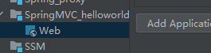
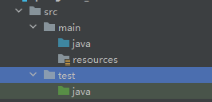
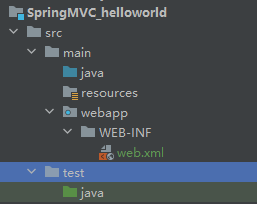
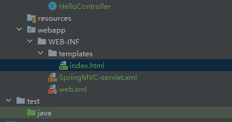
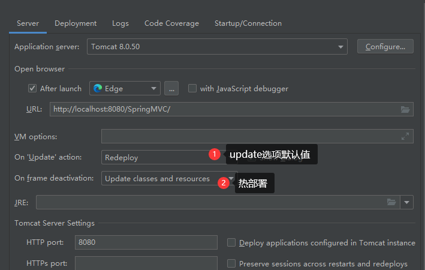
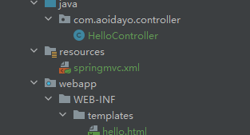
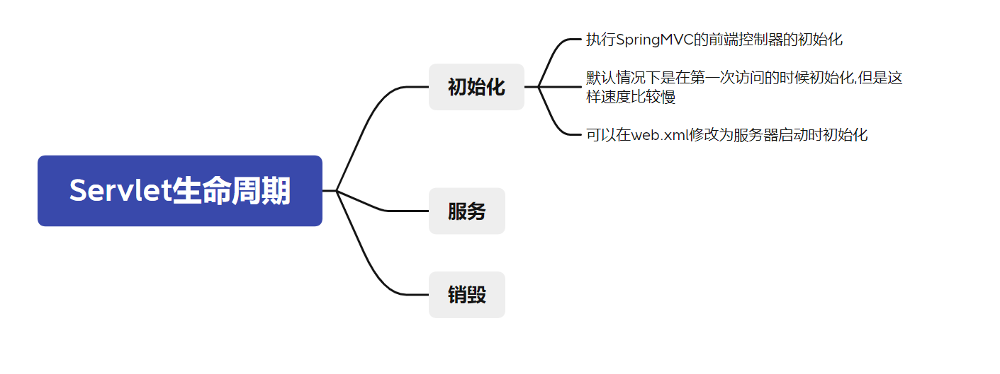

# 2、入门案例

## 2.1、开发环境

IDE：idea 2019.2

构建工具：maven3.5.4

服务器：tomcat8.5

Spring版本：5.3.1

## 2.2、创建maven工程

### ①添加web模块

### ②打包方式：war

```
<packaging>war</packaging>
```

自动建立web模块



此时文件夹结构:



添加web.xml:

```
web资源路径:
D:\doc\SSM\SSM\SpringMVC_helloworld\src\main\webapp
则web.xml应该在其下的WEB-INF文件夹中
D:\doc\SSM\SSM\SpringMVC_helloworld\src\main\webapp\WEB-INF\web.xml
```

此时配置成功



### ③引入依赖

```xml
<dependencies>
    <!-- SpringMVC -->
    <dependency>
        <groupId>org.springframework</groupId>
        <artifactId>spring-webmvc</artifactId>
        <version>5.3.1</version>
    </dependency>
    <!-- 日志 -->
    <dependency>
        <groupId>ch.qos.logback</groupId>
        <artifactId>logback-classic</artifactId>
        <version>1.2.3</version>
    </dependency>
    <!-- ServletAPI -->
    <dependency>
        <groupId>javax.servlet</groupId>
        <artifactId>javax.servlet-api</artifactId>
        <version>3.1.0</version>
        <scope>provided</scope>
    </dependency>
    <!-- Spring5和Thymeleaf整合包 -->
    <dependency>
        <groupId>org.thymeleaf</groupId>
        <artifactId>thymeleaf-spring5</artifactId>
        <version>3.0.12.RELEASE</version>
    </dependency>
</dependencies>
```

注：由于 Maven 的传递性，我们不必将所有需要的包全部配置依赖，而是配置最顶端的依赖，其他靠传递性导入。


## 2.3、配置web.xml

注册SpringMVC的前端控制器DispatcherServlet

### ①默认配置方式

在`DispatcherServlet`初始化的时候,加载SpringMvc的配置文件,自动完成(需要固定的名字和位置)

此配置作用下，SpringMVC的配置文件默认位于WEB-INF下，默认名称为`<servlet-name>-servlet.xml`，

例如，以下配置所对应SpringMVC的配置文件位于WEB-INF下，文件名为`springMVC-servlet.xml`

```xml
<!-- 配置SpringMVC的前端控制器，对浏览器发送的请求统一进行处理 -->
<servlet>
    <servlet-name>springMVC</servlet-name>
    <servlet-class>org.springframework.web.servlet.DispatcherServlet</servletclass>
</servlet>
<servlet-mapping>
    <servlet-name>springMVC</servlet-name>
    <!--
		静态资源默认交给defaultServlet处理,
		动态的请求和响应:
            设置springMVC的核心控制器所能处理的请求的请求路径模型
		<url-pattern>/</url-pattern>
            /所匹配的请求可以是/login或.html或.js或.css方式的请求路径
            但是/不能匹配.jsp请求路径的请求(jsp本质是servlet,需要被tomcat的web.xml文件中配置的JSPServlet处理)
			=============原因======================================================================
			jsp页面首先要被解释为字节码文件,通过响应的方式在页面中输出。
			我们在这里使用ThymeLeaf渲染Html页面，所以不需要处理jsp页面的请求
		<url-pattern>/*</url-pattern>匹配任意请求,包括.jsp的请求(虽然能够匹配.jsp请求,但是处理不了,所以不建议写/*)
		<url-pattern>/hello</url-pattern>
		<url-pattern>*.html</url-pattern>后缀匹配
	-->
    <url-pattern>/</url-pattern>
</servlet-mapping>
```

### ②扩展配置方式

可通过init-param标签设置SpringMVC配置文件的位置和名称，通过load-on-startup标签设置

SpringMVC前端控制器DispatcherServlet的初始化时间

```xml
<!-- 配置SpringMVC的前端控制器，对浏览器发送的请求统一进行处理 -->
<servlet>
    <servlet-name>springMVC</servlet-name>
    <servlet-class>org.springframework.web.servlet.DispatcherServlet</servletclass>
    <!-- 通过初始化参数指定SpringMVC配置文件的位置和名称 -->
    <init-param>
        <!-- contextConfigLocation为固定值 -->
        <param-name>contextConfigLocation</param-name>
        <!-- 使用classpath:表示从类路径查找配置文件，例如maven工程中的src/main/resources -->
        <param-value>classpath:springMVC.xml</param-value>
    </init-param>
    <!--
        作为框架的核心组件，在启动过程中有大量的初始化操作要做
        而这些操作放在第一次请求时才执行会严重影响访问速度
        因此需要通过此标签将启动控制DispatcherServlet的初始化时间提前到服务器启动时
	-->
    <load-on-startup>1</load-on-startup>
</servlet>
<servlet-mapping>
    <servlet-name>springMVC</servlet-name>
    <!--
        设置springMVC的核心控制器所能处理的请求的请求路径
        /所匹配的请求可以是/login或.html或.js或.css方式的请求路径
        但是/不能匹配.jsp请求路径的请求
    -->
    <url-pattern>/</url-pattern>
</servlet-mapping>
```

> 注：
>
> <url-pattern>标签中使用/和/*的区别：
>
> `/`所匹配的请求可以是/login或.html或.js或.css方式的请求路径，但是/不能匹配.jsp请求路径的请求
>
> 因此就可以避免在访问jsp页面时，该请求被DispatcherServlet处理，从而找不到相应的页面
>
> `/*`则能够匹配所有请求，例如在使用过滤器时，若需要对所有请求进行过滤，就需要使用/*的写法

## 2.4、创建请求控制器

由于前端控制器对浏览器发送的请求进行了统一的处理，但是具体的请求有不同的处理过程，因此需要创建处理具体请求的类，即请求控制器

请求控制器中每一个处理请求的方法成为控制器方法

因为SpringMVC的控制器由一个POJO（普通的Java类）担任，因此需要通过@Controller注解将其标识为一个控制层组件，交给Spring的IoC容器管理，此时SpringMVC才能够识别控制器的存在

```java
@Controller
public class HelloController {
}
```

## 2.5、创建SpringMVC的配置文件

```xml
<!-- 自动扫描包 -->
<context:component-scan base-package="com.atguigu.mvc.controller"/>
<!-- 配置Thymeleaf视图解析器 -->
<bean id="viewResolver"class="org.thymeleaf.spring5.view.ThymeleafViewResolver">
    <property name="order" value="1"/>
    <property name="characterEncoding" value="UTF-8"/>
    <property name="templateEngine">
         <!-- 内部bean -->
        <bean class="org.thymeleaf.spring5.SpringTemplateEngine">
             <!-- 再次注入 -->
            <property name="templateResolver">
                 <!-- 内部bean -->
                <bean
                      class="org.thymeleaf.spring5.templateresolver.SpringResourceTemplateResolver">
                   <!--
                            index.html的物理视图:/WEB-INF/templates/index.html
                                        逻辑视图:index
                                        可以通过index访问物理视图
                     -->
                    <!-- 视图前缀 -->
                    <property name="prefix" value="/WEB-INF/templates/"/>
                    <!-- 视图后缀 -->
                    <property name="suffix" value=".html"/>
                    <!--逻辑视图,加上视图的前缀和后缀,就是其路径,要跳转的页面=>解析为物理视图-->
                    <property name="templateMode" value="HTML5"/>
                    <property name="characterEncoding" value="UTF-8" />
                </bean>
            </property>
        </bean>
    </property>
</bean>
<!--
    处理静态资源，例如html、js、css、jpg
    若只设置该标签，则只能访问静态资源，其他请求则无法访问
    此时必须设置<mvc:annotation-driven/>解决问题
-->

<mvc:default-servlet-handler/>
<!-- 开启mvc注解驱动 -->

<mvc:annotation-driven>
    <mvc:message-converters>
        <!-- 处理响应中文内容乱码 -->
        <bean
              class="org.springframework.http.converter.StringHttpMessageConverter">
            <property name="defaultCharset" value="UTF-8" />
            <property name="supportedMediaTypes">
                <list>
                    <value>text/html</value>
                    <value>application/json</value>
                </list>
            </property>
        </bean>
    </mvc:message-converters>
</mvc:annotation-driven>
```

index.html位置



## Tomcat配置



## 2.6、测试HelloWorld

### ①实现对首页的访问

在请求控制器中创建处理请求的方法

```java
// @RequestMapping注解：处理请求和控制器方法之间的映射关系
// @RequestMapping注解的value属性可以通过请求地址匹配请求，/表示的当前工程的上下文路径
// localhost:8080/springMVC/
@RequestMapping("/")
public String index() {
    //设置视图名称
    return "index";
}
```

### ②通过超链接跳转到指定页面

在主页index.html中设置超链接

```html
<!DOCTYPE html>
<!--必须要有下面的这个约束,可以将他添加到HTML文件的模板里面-->
<html lang="en" xmlns:th="http://www.thymeleaf.org">
    <head>
        <meta charset="UTF-8">
        <title>首页</title>
    </head>
    <body>
        <h1>首页</h1>
        <!--@{/}被ThymeLeaf解析为当前工程的上下文路径,后面跟着的hello表示将要发送请求的地址-->
        <a th:href="@{/hello}">HelloWorld</a><br/>
        <!--路径被浏览器解析为localhost:8080/hello,无法访问,报404-->
        <a href="/hello">HelloWorld</a>
    </body>
</html>
```

在请求控制器中创建处理请求的方法

```java
@RequestMapping("/hello")
//请求映射在服务器端被解析为localhost:8080/hello,由当前的Controller处理,返回值String指明跳转的逻辑视图
//由ThymeLeaf处理,转至物理视图
public String HelloWorld() {
	return "target";
}
```

## 2.7、总结

浏览器发送请求，若请求地址符合前端控制器的url-pattern，该请求就会被前端控制器DispatcherServlet处理。
前端控制器会读取SpringMVC的核心配置文件，通过扫描组件找到控制器，将请求地址和控制器中@RequestMapping注解的value属性值进行匹配，若匹配成功，该注解所标识的控制器方法就是处理请求的方法。
处理请求的方法需要返回一个字符串类型的视图名称，该视图名称会被视图解析器解析，加上前缀和后缀组成视图的路径，通过Thymeleaf对视图进行渲染，最终转发到视图所对应页面

> 通过转发而非重定向

## 配置web.xml修改SpringMVC的配置文件地址

添加`<init-param>`,指定其名称和位置



```xml
<?xml version="1.0" encoding="UTF-8"?>
<web-app xmlns="http://xmlns.jcp.org/xml/ns/javaee"
         xmlns:xsi="http://www.w3.org/2001/XMLSchema-instance"
         xsi:schemaLocation="http://xmlns.jcp.org/xml/ns/javaee http://xmlns.jcp.org/xml/ns/javaee/web-app_4_0.xsd"
         version="4.0">
    <!-- 配置SpringMVC的前端控制器，对浏览器发送的请求统一进行处理 -->
    <servlet>
        <servlet-name>SpringMVC</servlet-name>
        <servlet-class>org.springframework.web.servlet.DispatcherServlet</servlet-class>
        <init-param>
            <!--指定springmvc文件位置和名称-->
            <param-name>contextConfigLocation</param-name>
            <param-value>classpath:springmvc.xml</param-value>
        </init-param>
    </servlet>
    <servlet-mapping>
        <servlet-name>SpringMVC</servlet-name>
        <url-pattern>/</url-pattern>
    </servlet-mapping>
</web-app>
```

## DispatcherServlet初始化时间提前至服务器启动时



修改web.xml文件,添加`load-on-startup`子标签

```xml
<?xml version="1.0" encoding="UTF-8"?>
<web-app xmlns="http://xmlns.jcp.org/xml/ns/javaee"
         xmlns:xsi="http://www.w3.org/2001/XMLSchema-instance"
         xsi:schemaLocation="http://xmlns.jcp.org/xml/ns/javaee http://xmlns.jcp.org/xml/ns/javaee/web-app_4_0.xsd"
         version="4.0">
    <!-- 配置SpringMVC的前端控制器，对浏览器发送的请求统一进行处理 -->
    <servlet>
        <servlet-name>SpringMVC</servlet-name>
        <servlet-class>org.springframework.web.servlet.DispatcherServlet</servlet-class>
        <init-param>
            <!--指定springmvc文件位置和名称-->
            <param-name>contextConfigLocation</param-name>
            <param-value>classpath:springmvc.xml</param-value>
        </init-param>
        <!--DispatcherServlet初始化时间提前至服务器启动时-->
        <load-on-startup>1</load-on-startup>
    </servlet>
    <servlet-mapping>
        <servlet-name>SpringMVC</servlet-name>
        <url-pattern>/</url-pattern>
    </servlet-mapping>
</web-app>
```