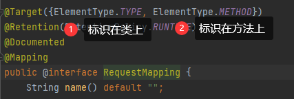
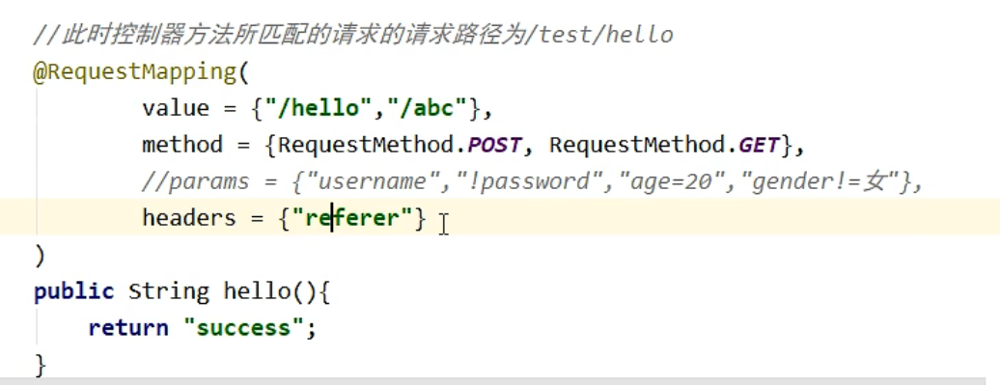

# 3、@RequestMapping注解

## 3.1、@RequestMapping注解的功能

从注解名称上我们可以看到，@RequestMapping注解的作用就是将请求和处理请求的控制器方法关联起来，建立映射关系。

SpringMVC 接收到指定的请求，就会来找到在映射关系中对应的控制器方法来处理这个请求。

## 3.2、@RequestMapping注解的位置



@RequestMapping标识一个类：设置映射请求的请求路径的==初始信息==

- 初始文件夹

@RequestMapping标识一个方法：设置映射请求请求路径的具体信息

- 具体的文件的地址

```java
@Controller
@RequestMapping("/test")
public class RequestMappingController {
    //此时请求映射所映射的请求的请求路径为：/test/testRequestMapping
    @RequestMapping("/testRequestMapping")
    public String testRequestMapping(){
        return "success";
    }
}
```

## 3.3、@RequestMapping注解的value属性

@RequestMapping注解的value属性通过请求的请求地址匹配请求映射

@RequestMapping注解的value属性是一个**字符串类型的数组**，表示该请求映射能够匹配多个请求地址所对应的请求

- 控制器方法可以处理多个请求

@RequestMapping注解的value属性必须设置，至少通过请求地址匹配请求映射

```html
<a th:href="@{/testRequestMapping}">测试@RequestMapping的value属性--
>/testRequestMapping</a><br>
<a th:href="@{/test}">测试@RequestMapping的value属性-->/test</a><br>
```

```java
@RequestMapping(
    value = {"/testRequestMapping", "/test"}
)
public String testRequestMapping(){
    return "success";
}
```

```java
@RequestMapping({"/testRequestMapping", "/test"})
public String testRequestMapping(){
    return "success";
}
```

## 3.4、@RequestMapping注解的method属性

```java
RequestMethod[] method() default {};
```

@RequestMapping注解的method属性通过请求的请求方式（**get或post**）匹配请求映射

@RequestMapping注解的method属性是一个RequestMethod类型的数组，表示该请求映射能够匹配多种请求方式的请求

若当前请求的请求地址满足`@RequestMapping`请求映射的value属性，但是请求方式不满足method属性，则浏览器**报错**

> 405：Request method 'POST' not supported

```xml
<a th:href="@{/test}">测试@RequestMapping的value属性-->/test</a><br>
<!--默认GET方法提交-->
<form th:action="@{/test}" method="post">
	<input type="submit">
</form>
<!--默认GET方法提交,method设置POST提交-->
```

```java
@RequestMapping(
    value = {"/testRequestMapping", "/test"},
    method = {RequestMethod.GET, RequestMethod.POST}
    //去掉POST,访问test报405Error
)
public String testRequestMapping(){
    return "success";
}
```

多种请求方式

>GET, POST, HEAD, OPTIONS, ==PUT==, PATCH, ==DELETE==, TRACE.
>
>PUT和DELETE后续会讲

> 注：
>
> 1、对于处理指定请求方式的控制器方法，SpringMVC中提供了@RequestMapping的**派生注解**
>
> - 处理get请求的映射-->@GetMapping
>
> - 处理post请求的映射-->@PostMapping
>
> - 处理put请求的映射-->@PutMapping
>
> - 处理delete请求的映射-->@DeleteMapping
>
> 2、常用的请求方式有get，post，put，delete但是目前浏览器只支持**get和post**，
> 若在form表单提交时，为method设置了其他请求方式的字符串（put或delete），则按照默认的请求方式get处理
>
> 若要发送put和delete请求，则需要通过spring提供的过滤器HiddenHttpMethodFilter，在RESTful部分会讲到
>

## 3.5、@RequestMapping注解的params属性（了解）

```java
String[] params() default {};
```

@RequestMapping注解的params属性**通过请求的请求参数匹配请求映射**

@RequestMapping注解的params属性是一个字符串类型的数组，可以通过四种表达式设置请求参数和请求映射的匹配关系

"param"：要求请求映射所匹配的请求必须携带param请求参数

"!param"：要求请求映射所匹配的请求必须不能携带param请求参数

"param=value"：要求请求映射所匹配的请求必须携带param请求参数且param=value

"param!=value"：要求请求映射所匹配的请求必须携带param请求参数但是param!=value

```html
<a th:href="@{/test(username='admin',password=123456)">测试@RequestMapping的
params属性-->/test</a><br>
```

```java
@RequestMapping(
    value = {"/testRequestMapping", "/test"}
    ,method = {RequestMethod.GET, RequestMethod.POST}
    ,params = {"username","password!=123456"}
)
public String testRequestMapping(){
    return "success";
}
```

> 注：
>
> 若当前请求满足@RequestMapping注解的value和method属性，但是不满足params属性，
> 此时页面回报错400：
>
> ```
> Parameter conditions "username, password!=123456" not met for actual request parameters: username={admin}, password={123456}
> ```

## 3.6、@RequestMapping注解的headers属性（了解）

```java
String[] headers() default {};
```

@RequestMapping注解的headers属性**通过请求的请求头信息匹配**请求映射

@RequestMapping注解的headers属性是一个字符串类型的数组，可以通过四种表达式设置请求头信息和请求映射的匹配关系

- "header"：要求请求映射所匹配的请求必须携带header请求头信息

- "!header"：要求请求映射所匹配的请求必须不能携带header请求头信息

- "header=value"：要求请求映射所匹配的请求必须携带header请求头信息且header=value

- "header!=value"：要求请求映射所匹配的请求必须携带header请求头信息且header!=value

> 若当前请求满足@RequestMapping注解的value和method属性，但是不满足headers属性，此时页面显示404错误，即资源未找到




> 请求头和响应头的键不区分大小写;

## 3.7、SpringMVC支持ant风格的路径

> value属性有一个别名:path;这个就是用于修改value的;

`？`：表示任意的单个字符(不包括`?`)

`*`：表示任意的0个或多个字符(不包括`?`和`/`)

`**`：表示任意层数的任意目录(只能写在双斜杠中,不能有其他字符)

```java
@RequestMapping(
    value = {
        "/abc/test/testRequestMapping", 
        "/**/testRequestMapping",
    	"/a?c/test/testRequestMapping",
        "/*/test/testRequestMapping",
    }
)
public String testRequestMapping(){
    return "success";
}
```

注意：在使用`**`时，只能使用`/**/xxx`的方式

## 3.8、SpringMVC支持路径中的占位符（重点）

原始方式：`/deleteUser?id=1`

rest方式：`/user/delete/1`

SpringMVC路径中的占位符常用于**RESTful**风格中，当请求路径中**将某些数据通过路径的方式**传输到服务器中，就可以在相应的`@RequestMapping`注解的value属性中**通过占位符{xxx}表示传输的数据**，在通过`@PathVariable`注解，将占位符所表示的数据赋值给控制器方法的形参,其value就是之前那个注解中`占位符{xxx}的xxx`

```html
<a th:href="@{/testRest/1/admin}">测试路径中的占位符-->/testRest</a><br>
```

```java
@RequestMapping("/testRest/{id}/{username}")
public String testRest(@PathVariable("id") String id, @PathVariable("username") String username){
    System.out.println("id:"+id+",username:"+username);
    return "success";
}
//最终输出的内容为-->id:1,username:admin
```

