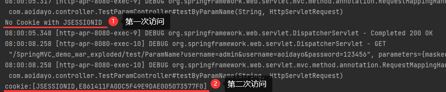

# 4、SpringMVC获取请求参数

新建一个测试Controller

```java
@Controller
public class TestParamController {
    
}
```

## 4.1、通过ServletAPI获取

将`HttpServletRequest`作为控制器方法的形参，此时HttpServletRequest类型的参数表示封装了当前请求的请求报文的对象

也可以使用`Response/Session`

> 由DispatcherServlet调用Controller的处理方法，如果检测到形参里面有HttpServletRequest类型的参数,将会为其自动赋值。

```java
@RequestMapping("/testParam")
public String testParam(HttpServletRequest request){
    String username = request.getParameter("username");
    String password = request.getParameter("password");
    System.out.println("username:"+username+",password:"+password);
    return "success";
}
```

## 4.2、通过控制器方法的形参获取请求参数

在控制器方法的形参位置，==设置和请求参数同名的形参==，当浏览器发送请求，匹配到请求映射时，在==DispatcherServlet==中就会将请求参数赋值给==相应的形参==

```html
<a th:href="@{/testParam(username='admin',password=123456)}">测试获取请求参数--</a><br>
```

通过`@RequestParam`设置请求传输参数和控制器方法中形参的对应关系

有一个`required`参数,true时必须传入这个参数,如果没有传入则会抛出异常

```java
    @RequestMapping("/test/ParamName")
    public String testByParamName(@RequestParam("username",required = true) String arg1, @RequestParam("password") String arg2){
        System.out.println(arg1+" "+arg2);
        return "success";
    }
```

在请求传输参数和控制器方法中形参同名时,也可以不设置


```java
@RequestMapping("/testParam")
public String testParam(String username, String password){
    System.out.println("username:"+username+",password:"+password);
    return "success";
}
```

> 注：
>
> 若请求所传输的请求参数中有**多个同名的请求参数**，此时可以在控制器方法的形参中设置**字符串数组**或者字符串类型的形参接收此请求参数
>
> - 若使用字符串数组类型的形参，此参数的数组中包含了每一个数据
>
> - 若使用字符串类型的形参，此参数的值为每个数据中间使用逗号拼接的结果

```xml
<a th:href="@{/test/ParamName(username='admin',password=123456,username='aoidayo')}"></a>
```

```java
    //数组
	@RequestMapping("/test/ParamName")
    public String testByParamName(@RequestParam(value = "username",required = true) String[] arg1, @RequestParam("password") String arg2){
        for (String arg:arg1){
            System.out.println(arg);
            /*
            admin
            aoidayo
            参数替换为@RequestParam(value = "username",required = true) String arg1
             */
        }
        return "success";
    }
```

```java
	//字符串
	@RequestMapping("/test/ParamName")
    public String testByParamName(@RequestParam(value = "username",required = true) String arg1, @RequestParam("password") String arg2){
        System.out.println("username:"+arg1);
        //username:admin,aoidayo
        return "success";
    }
```

## 4.3、@RequestParam

@RequestParam是将请求参数和控制器方法的形参创建映射关系

@RequestParam注解一共有三个属性：

value：指定为形参赋值的请求参数的参数名

required：设置是否必须传输此请求参数，默认值为true

- 若设置为true时，则当前请求必须传输value所指定的请求参数，
  - 若没有传输该请求参数，且没有设置defaultValue属性，则页面报错`400：Required String parameter 'xxx' is not present；`
  - 若没有传输该请求参数，但设置了defaultValue属性,则不会报错

- 若设置为false，则当前请求不是必须传输value所指定的请求参数，
  - 若没有传输，则注解所标识的形参的值为null; 如果设置了defaultValue属性,则形参被赋值为默认值

defaultValue：不管required属性值为true或false，当value所指定的请求参数没有传输或传输的值为""时，则使用默认值为形参赋值

## 4.4、@RequestHeader

@RequestHeader是将**请求头信息和控制器方法的形参**创建映射关系

@RequestHeader注解一共有三个属性：value、required、defaultValue，用法同@RequestParam

```java
    @RequestMapping("/test/ParamName")
    public String testByParamName(@RequestHeader("referer")String referer){
        System.out.println("username:"+arg1);
        //username:admin,aoidayo
        return "success";
    }
```

## 4.5、@CookieValue

@CookieValue是将==cookie数据和控制器方法的形参==创建映射关系

@CookieValue注解一共有三个属性：value、required、defaultValue，用法同@RequestParam

```java
    @RequestMapping("/test/ParamName")
    public String testByParamName(@CookieValue(value = "JSESSIONID",required = false)String cookie,HttpServletRequest request){
        //使用requset获取一个session,自动创建一个JSESSIONID,此时会在响应头中作为cookie返回,其值为一个随机值
        HttpSession session = request.getSession();
        if(cookie==null) System.out.println("No Cookie with JSESSIONID");
        else System.out.println("cookie:[JSESSIONID,"+cookie+"]");
        return "success";
    }
```



## 4.6、通过POJO获取请求参数

可以在控制器方法的形参位置**设置一个实体类类型**的形参，此时若浏览器**传输的请求参数的参数名和实体类中的属性名一致**，那么请求参数就会为此属性赋值

- 将请求参数中的值给这个实体类赋值
- 如果没有传递这个名字的参数的值,则默认为null

```java
//pojo
public class User {
    Integer id;
    String username;
    String password;
}
```

```html
<form th:action="@{/testpojo}" method="post">
    用户名：<input type="text" name="username"><br>
    密码：<input type="password" name="password"><br>
    <input type="submit">
</form>
```

```java
@RequestMapping("/testpojo")
public String testPOJO(User user){
    System.out.println(user);
    return "success";
}
//User{id=null, username='Aoidayo', password='201741'}
```

## 4.7、解决获取请求参数的乱码问题

> 为什么不能再控制器方法中获取Requset再通过Requset设置编码格式为UTF-8呢?
>
> - 因为方法中的参数已经由DispatcherServlet通过Requset获取了一遍,此时再设置编码没有用了
>   - Requset也是通过**DispatcherServlet**传递的
>
> 下面配置的原理可以通过查看CharacterEncodingFilter类的源码得出

解决获取请求参数的乱码问题，可以使用SpringMVC提供的编码过滤器CharacterEncodingFilter，但是必须在web.xml中进行注册

```xml
<!--配置springMVC的编码过滤器-->
<filter>
    <!--
		CharacterEncodingFilter类
	-->
    <filter-name>CharacterEncodingFilter</filter-name>
    <!--
		CharacterEncodingFilter类
	-->
    <filter-class>org.springframework.web.filter.CharacterEncodingFilter</filter-class>
    <init-param>
        <param-name>encoding</param-name>
        <param-value>UTF-8</param-value>
    </init-param>
    <init-param>
        <param-name>forceEncoding</param-name>
        <param-value>true</param-value>
    </init-param>
    <!--
		forceEncoding:
			false:只会将requset的编码设置为UTF-8
			true:同时将requset和response的编码设置为UTF-8
	-->
</filter>

<filter-mapping>
    <filter-name>CharacterEncodingFilter</filter-name>
    <url-pattern>/*</url-pattern>
</filter-mapping>
```

> 注：SpringMVC中处理编码的过滤器一定要配置到其他过滤器之前，否则无效
>
> SpringMVC的过滤器配置就两个,另外一个配置后需要获取一个init-param:_method的参数,所以编码过滤器需要配置在它前面
>
> 过滤器执行的顺序与我们在web.xml中配置的前后顺序有关,越靠前过滤器越早执行

结果:

```java
User{id=null, username='王非凡', password='201741'}
//没有乱码
```

