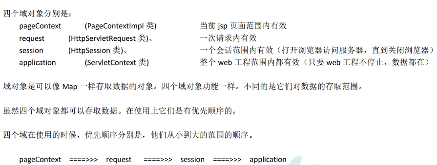
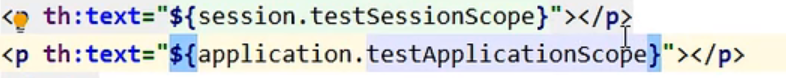
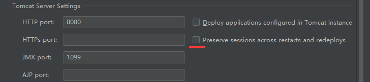

# 5、域对象共享数据

jsp中有四个,现在在ThymeLeaf中废弃一个`pageContext`



- request
- session:[浏览器开,~关]
- application:[web应用开,~关]

## 5.1、使用ServletAPI向request域对象共享数据

```java
@RequestMapping("/testServletAPI")
public String testServletAPI(HttpServletRequest request){
    request.setAttribute("testScope", "hello,servletAPI");
    return "success";
}
```

## 5.2、使用ModelAndView向request域对象共享数据(底层使用)

>向请求域共享数据和页面跳转最终都会被实现为`ModelAndView`

> ThymeLeaf语法:
>
> - th:text属性
>   - 渲染标签中的文本节点的内容
>   - ${}:获取requset请求中的参数
>   - 也可以是普通的文本

```java
@RequestMapping("/testModelAndView")
public ModelAndView testModelAndView(){
    /**
     * ModelAndView有Model和View的功能
     * Model主要用于向请求域共享数据
     * View主要用于设置逻辑视图，实现页面跳转
     */
    ModelAndView mav = new ModelAndView();
    //向请求域共享数据
    mav.addObject("testScope", "hello,ModelAndView");
    //设置视图，实现页面跳转
    mav.setViewName("success");
    //使用mav必须返回,不然设置了无效
    //控制器方法必须将ModelAndView作为方法的返回值
    return mav;
}
```

### 测试:

A页面

```java
    <h1>测试从控制器端传递参数返回页面</h1>
    <a th:href="@{/test/sendDataByModelAndView}">通过ModelAndView</a><br/>
```

控制器

```java
    /**
     * 测试通过ModelAndView向域共享数据
     * @return
     */
    @RequestMapping("/test/sendDataByModelAndView")
    public ModelAndView test1(){
        ModelAndView modelAndView = new ModelAndView();
        modelAndView.addObject("mav","Hello ModelAndView!");
        modelAndView.setViewName("success");
        return modelAndView;
    }
```

转向B页面

```html
<h1>Success.html</h1>
<h1 th:text="${mav}"></h1>
```

## 5.3、使用Model向request域对象共享数据(一般)

> Model不能自己创建,是由DispatcherServlet调用此方法是自动根据参数类型创建的
>
> `Model`是一个接口,传递进去的运行时类型其实并不是`Model`类

```java
@RequestMapping("/testModel")
public String testModel(Model model){
    sout(model.getClass().getName());//BindingAwareModelMap
    model.addAttribute("testScope", "hello,Model");
    return "success";
}
```

## 5.4、使用map向request域对象共享数据

```java
@RequestMapping("/testMap")
public String testMap(Map<String, Object> map){
    sout(map.getClass().getName());//BindingAwareModelMap
    map.put("testScope", "hello,Map");
    return "success";
}
```

## 5.5、使用ModelMap向request域对象共享数据

```java
@RequestMapping("/testModelMap")
public String testModelMap(ModelMap modelMap){
    sout(modelMap.getClass().getName());//BindingAwareModelMap
    modelMap.addAttribute("testScope", "hello,ModelMap");
    return "success";
}
```

## 5.6、Model、ModelMap、Map的关系

Model、ModelMap、Map类型的参数其实本质上都是 BindingAwareModelMap 类型的

> 都是BindingAwareModelMap创建的

```java
public interface Model{}
public class ModelMap extends LinkedHashMap<String, Object> {}
public class ExtendedModelMap extends ModelMap implements Model {}
public class BindingAwareModelMap extends ExtendedModelMap {}
```

## 5.7、向session域共享数据

> 可以直接通过参数类型获取session
>
> 

```java
@RequestMapping("/testSession")
public String testSession(HttpSession session){
    session.setAttribute("testSessionScope", "hello,session");
    return "success";
}
```

> session域中数据的钝化和活化;
>
> 如果浏览器页面未关闭,而工程重新部署,则此时session域中的数据将会被钝化到tomcat的work文件夹中
>
> - 若此时在`IDEA`中开启了下方标红的选项,则会在下次工程部署的时候将session域中的数据重新注入新的session域中(又称活化)
>
> - 若没有开启,则不会保留session域中的内容
>
> 
>
> 注意:如果需要向session域中注入一个实体化类的实例,则这个实体化类需要实现一个序列化接口`Serializable`

## 5.8、向application域共享数据

```java
@RequestMapping("/testApplication")
public String testApplication(HttpSession session){
    ServletContext application = session.getServletContext();
    application.setAttribute("testApplicationScope", "hello,application");
    return "success";
}
```
