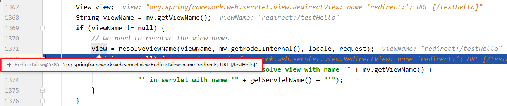

# 6、SpringMVC的视图

SpringMVC中的视图是View接口，视图的作用渲染数据，将模型Model中的数据展示给用户

SpringMVC视图的种类很多，默认有转发视图和重定向视图

- 当工程引入jstl的依赖，转发视图会自动转换为JstlView

- 若使用的视图技术为Thymeleaf，在SpringMVC的配置文件中配置了Thymeleaf的视图解析器，由此视图解析器解析之后所得到的是ThymeleafView

> 控制器方法执行完后,即使没有使用ModelAndView,DispatcherServlet都会统一封装获取一个ModelAndView对象
>
> 
>
> 执行转发结果
>
> 

## 6.1、ThymeleafView(常用)

当控制器方法中所设置的视图名称**没有任何前缀**时，此时的视图名称会被SpringMVC配置文件中所配置的视图解析器解析，视图名称拼接视图前缀和视图

后缀所得到的最终路径，会通过**转发**的方式实现跳转(转发,而不是重定向)

```java
@RequestMapping("/testHello")
public String testHello(){
	return "hello";
}
```


## 6.2、转发视图InternalResourceView

SpringMVC中默认的转发视图是InternalResourceView

SpringMVC中创建转发视图的情况：

当控制器方法中所设置的视图名称**以"forward:"为前缀**时，创建InternalResourceView视图，**此时的视图名称不会被SpringMVC配置文件中所配置的视图解析器解析**，而是会将前缀"forward:"去掉，**剩余部分作为最终路径通过转发的方式实现跳转**

例如"forward:/"，"forward:/employee"

```java
@RequestMapping("/testForward")
public String testForward(){
	return "forward:/testHello";
}
```


> 请求转发:
>
> 自动拼接上下文路径`localhost:8080/SpringMVC_demo_war_exploded/test/testInternalResourceView`
>
> 请求转发完成后,路径不改变,但是请求转发到`/testHello`,处理后面转发到另一个页面`success.html`
>
> 比较:
>
> - ThymeLeaf的转发会进行页面渲染
> - 请求转发仅仅只是转发,使用th语法的标签不会获取到任何信息,不能进行页面渲染

## 6.3、重定向视图RedirectView(常用)

SpringMVC中默认的重定向视图是RedirectView

当控制器方法中所设置的视图名称**以"redirect:"为前缀**时，创建RedirectView视图，**此时的视图名称不会被SpringMVC配置文件中所配置的视图解析器解析**，而是会将前缀"redirect:"去掉，**剩余部分作为最终路径通过重定向的方式实现跳转**

例如"redirect:/"，"redirect:/employee"

```java
@RequestMapping("/testRedirect")
public String testRedirect(){
	return "redirect:/testHello";
}
```



> 重定向后:地址栏发生变化
>
> 从`localhost:8080/SpringMVC_demo_war_exploded/test/testRedirect`
>
> 变为`localhost:8080/SpringMVC_demo_war_exploded/testHello`
>
> 注意:
>
> - 业务逻辑处理成功--->重定向(登陆成功)
> - 业务逻辑处理失败--->转发(登陆失败)
>
> 注：
>
> 重定向视图在解析时，会先将redirect:前缀去掉，然后会判断剩余部分是否以/开头，若是则会自动拼接上下文路径
>

## 6.4、视图控制器view-controller

当控制器方法中，仅仅用来实现页面跳转，即只需要设置视图名称时，可以将处理器方法使用==viewcontroller==标签进行表示

```java
@RequestMapping("/")
public String protal(){
    return "index";
}
```

```xml
<!--在SpringMVC的核心配置文件中配置-->
<!--视图控制器-->
<mvc:view-controller path="/" view-name="index"></mvc:view-controller>
<!--
    path：设置处理的请求地址
    view-name：设置请求地址所对应的视图名称
-->
<mvc:view-controller path="/testView" view-name="success"></mvc:view-controller>
```

> 注：
>
> 当SpringMVC中设置任何一个view-controller时，只有它设置的请求会被处理，其他请求全部404
>
> **其他控制器中的请求映射将全部失效**，
> 此时需要在SpringMVC的核心配置文件中设置**开启mvc注解驱动**的标签：由视图控制器和`@RequsetMapping`注解的请求都会被处理
>
> ```
> <mvc:annotation-driven />
> ```
