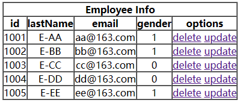
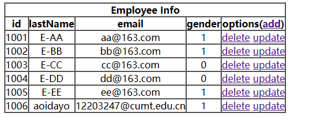
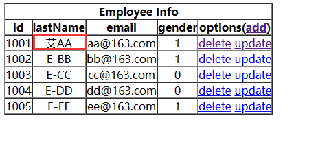

# 8、RESTful案例

## 8.1、准备工作

和传统 CRUD 一样，实现对员工信息的增删改查。

- 搭建环境
- 准备实体类

```java
package com.atguigu.mvc.bean;
public class Employee {
    private Integer id;
    private String lastName;
    private String email;
    //1 male, 0 female
    private Integer gender;
    public Integer getId() {
        return id;
    }
    public void setId(Integer id) {
        this.id = id;
    }
    public String getLastName() {
        return lastName;
    }
    public void setLastName(String lastName) {
        this.lastName = lastName;
    }
    public String getEmail() {
        return email;
    }
    public void setEmail(String email) {
        this.email = email;
    }
    public Integer getGender() {
        return gender;
    }
    public void setGender(Integer gender) {
        this.gender = gender;
    }
    public Employee(Integer id, String lastName, String email, Integergender) {
        super();
        this.id = id;
        this.lastName = lastName;
        this.email = email;
        this.gender = gender;
    }
    public Employee() {
    }
}
```

- 准备dao模拟数据

```java
package com.atguigu.mvc.dao;
import java.util.Collection;
import java.util.HashMap;
import java.util.Map;
import com.atguigu.mvc.bean.Employee;
import org.springframework.stereotype.Repository;
@Repository
public class EmployeeDao {
    private static Map<Integer, Employee> employees = null;
    static{
        employees = new HashMap<Integer, Employee>();
        employees.put(1001, new Employee(1001, "E-AA", "aa@163.com", 1));
        employees.put(1002, new Employee(1002, "E-BB", "bb@163.com", 1));
        employees.put(1003, new Employee(1003, "E-CC", "cc@163.com", 0));
        employees.put(1004, new Employee(1004, "E-DD", "dd@163.com", 0));
        employees.put(1005, new Employee(1005, "E-EE", "ee@163.com", 1));
    }
    private static Integer initId = 1006;
    public void save(Employee employee){
        if(employee.getId() == null){
            employee.setId(initId++);
        }
        employees.put(employee.getId(), employee);
    }
    public Collection<Employee> getAll(){
        return employees.values();
    }
    public Employee get(Integer id){
        return employees.get(id);
    }
    public void delete(Integer id){
        employees.remove(id);
    }
}
```

## 8.2、功能清单

| **功能**                | **URL** **地址** | **请求方式**                        |
| ----------------------- | ---------------- | ----------------------------------- |
| 访问首页√               | /                | GET                                 |
| 查询全部数据√           | /employee        | GET                                 |
| 删除√                   | /employee/2      | DELETE(ID直接传输)                  |
| 跳转到添加数据页面√     | /toAdd           | GET                                 |
| 执行添加/保存√          | /employee        | POST(详细信息通过表单提交)          |
| 跳转到修改更新数据页面√ | /employee/2      | GET(先查询员工信息在跳转到修改页面) |
| 执行更新√               | /employee        | PUT(详细信息通过表单提交)           |

## 8.3、具体功能：访问首页

### ①配置view-controller

```xml
<mvc:view-controller path="/" view-name="index"/>
```

### ②创建页面

```html
<!DOCTYPE html>
<html lang="en" xmlns:th="http://www.thymeleaf.org">
    <head>
        <meta charset="UTF-8" >
        <title>Title</title>
    </head>
    <body>
        <h1>首页</h1>
        <a th:href="@{/employee}">访问员工信息</a>
    </body>
</html>
```

## 8.4、具体功能：查询所有员工数据

### ①控制器方法

```java
@RequestMapping(value = "/employee", method = RequestMethod.GET)
public String getEmployeeList(Model model){
    Collection<Employee> employeeList = employeeDao.getAll();
    model.addAttribute("employeeList", employeeList);
    return "employee_list";
}
```

### ②创建employee_list.html

```html
<!DOCTYPE html>
<html lang="en" xmlns:th="http://www.thymeleaf.org">
    <head>
        <meta charset="UTF-8">
        <title>Employee Info</title>
        <script type="text/javascript" th:src="@{/static/js/vue.js}"></script>
    </head>
    <body>
        
        <table border="1" cellpadding="0" cellspacing="0" style="text-align:center;" id="dataTable">
            <tr>
                <th colspan="5">Employee Info</th>
            </tr>
            <tr>
                <th>id</th>
                <th>lastName</th>
                <th>email</th>
                <th>gender</th>
                <th>options(<a th:href="@{/toAdd}">add</a>)</th>
            </tr>
            <!--使用th标签循环输出-->
            <tr th:each="employee : ${employeeList}">
                <td th:text="${employee.id}"></td>
                <td th:text="${employee.lastName}"></td>
                <td th:text="${employee.email}"></td>
                <td th:text="${employee.gender}"></td>
                <td>
                    <a class="deleteA" @click="deleteEmployee"
                       th:href="@{'/employee/'+${employee.id}}">delete</a>
                    <a th:href="@{'/employee/'+${employee.id}}">update</a>
                </td>
            </tr>
        </table>
        
    </body>
</html>
```

查询成功



### 静态资源的问题:

> 1. 两个web.xml的关系
>
> 首先:在Tomcat中存在一个web.xml,里面也配置了一个dafaultServlet,其url-pattern也是`/`
>
> 它和我们Spring工程里的web.xml可以说是继承关系
>
> 我们配置的DispatcherServlet的url-pattern是`/`,则DispatcherServlet会覆盖defaultServlet;
>
> 但是要注意:DispatcherServlet不能处理向静态资源的请求,所以此时需要修改`静态资源:css,js...`为defaultServlet处理
>
> 2. 在`Spring核心配置文件`中进行默认servlet的配置
>
> ```xml
>     <!--
>         在springmvc核心配置文件中配置默认servlet处理静态资源
>         1. 如果只配置了defaultservlet的话,所有的请求都会被它处理;但是它不能处理我们的动态请求
>         2. 同时配置mvc的注解驱动时,请求会先被DispatcherServlet处理,处理不了传递给defaultservlet处理
>     -->
>     <mvc:default-servlet-handler/>
> 
>     <!--配置控制方法的注解驱动-->
>     <mvc:annotation-driven/>
> ```
>
> 

### 跳转方法=>8.6

```html
<th>options(<a th:href="@{/toAdd}">add</a>)</th>
```

跳转到添加页面,直接在核心配置文件中配置视图控制器

```xml
<mvc:view-controller path="/toAdd" view-name="employee_add"></mvc:view-controller>
```

## 8.6、具体功能：跳转到添加数据页面

### ①配置view-controller

```xml
<mvc:view-controller path="/toAdd" view-name="employee_add"></mvc:view-controller>
```

### ②创建employee_add.html

```html
<!DOCTYPE html>
<html lang="en" xmlns:th="http://www.thymeleaf.org">
    <head>
        <meta charset="UTF-8">
        <title>Add Employee</title>
    </head>
    <body>
        <form th:action="@{/employee}" method="post">
            lastName:<input type="text" name="lastName"><br>
            email:<input type="text" name="email"><br>
            gender:<input type="radio" name="gender" value="1">male
            <input type="radio" name="gender" value="0">female<br>
            <input type="submit" value="add"><br>
        </form>
    </body>
</html>
```

## 8.7、具体功能：执行保存

### ①控制器方法

```java
@RequestMapping(value = "/employee", method = RequestMethod.POST)
public String addEmployee(Employee employee){
    employeeDao.save(employee);
    //跳转到employee,使用GET方法,重新获取所有员工的信息并输出到employee-list页面上
    //业务逻辑处理成功,此时重定向:相当于浏览器再次发送一次访问/employee的get请求
    return "redirect:/employee";
}
```



此时添加成功

## 8.8、具体功能：跳转到更新数据页面

### ①修改超链接

需要传递employee的id信息,如果直接写`<a th:href="@{/employee/${employee.id}}">update</a>`,会被当做路径直接解析,${}不会作为表达式获取值

加上单引号拼接成一个路径

```html
<a th:href="@{'/employee/'+${employee.id}}">update</a>
```

### ②控制器方法

```java
@RequestMapping(value = "/employee/{id}", method = RequestMethod.GET)
//先查询,所以是GET;跳转到修改页面
public String getEmployeeById(@PathVariable("id") Integer id, Model model){
    Employee employee = employeeDao.get(id);
    //查询到后需要传递给修改页面,所以放在model中
    model.addAttribute("employee", employee);
    return "employee_update";
}
```

### ③创建employee_update.html

仅仅展示lastName,email,gender这几个可修改属性,其余的id和_method需要隐藏

```html
<!DOCTYPE html>
<html lang="en" xmlns:th="http://www.thymeleaf.org">
    <head>
        <meta charset="UTF-8">
        <title>Update Employee</title>
    </head>
    <body>
        <form th:action="@{/employee}" method="post">
            <input type="hidden" name="_method" value="put">
            <input type="hidden" name="id" th:value="${employee.id}">
            lastName:<input type="text" name="lastName" th:value="${employee.lastName}">
            <br>
            email:<input type="text" name="email" th:value="${employee.email}"><br>
            <!--
                th:field="${employee.gender}"可用于单选框或复选框的回显
                若单选框的value和employee.gender的值一致，则添加checked="checked"属性
				若单选框的value和employee.gender的值不一致，则不会添加checked="checked"属性
			-->
            gender:<input type="radio" name="gender" value="1" th:field="${employee.gender}">male
            <input type="radio" name="gender" value="0"th:field="${employee.gender}">female<br>
            <input type="submit" value="update"><br>
        </form>
    </body>
</html>
```

## 8.9、具体功能：执行更新

### ①控制器方法

```java
@RequestMapping(value = "/employee", method = RequestMethod.PUT)
public String updateEmployee(Employee employee){
    //执行更新,此时save执行的就是更新而不是添加
    employeeDao.save(employee);
    //修改完成重定向
    return "redirect:/employee";
}
```

修改成功



## 8.5、具体功能：删除

删除功能的分析:

需要使用`delete`的请求,但是必须通过form表单的post请求转换为delete;

也就是说我们需要让一个delete的超链接控制一个form表单的提交,且表单提交的action必须由超链接传递员工的id生成

### ①创建处理delete请求方式的表单

```html
<!-- 作用：通过超链接控制表单的提交，将post请求转换为delete请求 -->
<form id="delete_form" method="post">
    <!-- HiddenHttpMethodFilter要求：必须传输_method请求参数，并且值为最终的请求方式 -->
    <input type="hidden" name="_method" value="delete"/>
</form>
```

引入vue.js

```html
<script type="text/javascript" th:src="@{/static/js/vue.js}"></script>
```

删除超链接

```html
<a class="deleteA" @click="deleteEmployee" th:href="@{'/employee/'+${employee.id}}">delete</a>
```

通过vue处理点击事件

```html
<script type="text/javascript">
    var vue = new Vue({
        el:"#dataTable",
        methods:{
            //event表示当前事件
            deleteEmployee:function (event) {
                //通过id获取表单标签
                var delete_form = document.getElementById("delete_form");
                //将触发事件的超链接的href属性为表单的action属性赋值
                delete_form.action = event.target.href;
                //提交表单
                delete_form.submit();
                //阻止超链接的默认跳转行为
                event.preventDefault();
            }
        }
    });
</script>
```

### ③控制器方法

```java
@RequestMapping(value = "/employee/{id}", method = RequestMethod.DELETE)
public String deleteEmployee(@PathVariable("id") Integer id){
    employeeDao.delete(id);
    return "redirect:/employee";
}
```

